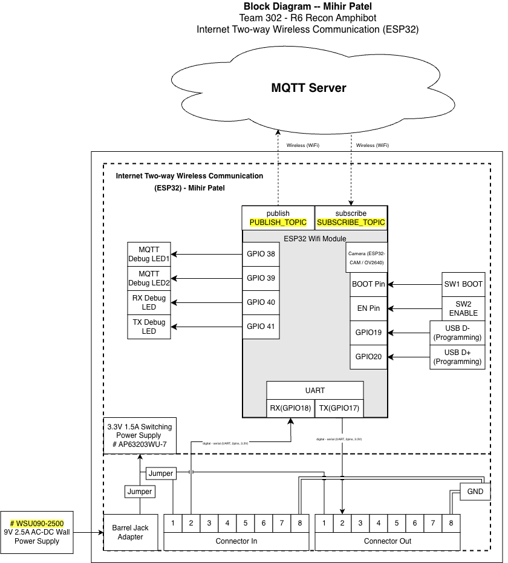

## Overview

This block diagram represents the **ESP32-based Internet Two-way Wireless Communication subsystem** developed by **Mihir Patel** for **Team 302 – R6 Recon Amphibot**. The purpose of this subsystem is to act as the team’s wireless gateway, enabling remote communication with the operator while coordinating data exchange between onboard subsystems through a **UART daisy-chain architecture**.

The diagram follows the **EGR314 block diagram standard** and clearly separates this individual subsystem from the rest of the system using a defined subsystem boundary. All major electrical components, communication interfaces, and power paths are shown with labeled signal directions, specific GPIO pin numbers, and voltage levels.

---

## Subsystem Functionality

The ESP32 Wireless Gateway performs three primary functions within the overall exploration device:

### 1. Two-Way Wireless Communication

The ESP32 connects to an external **MQTT Server** over Wi-Fi.

- Telemetry, system status, and debug information are published to **`PUBLISH_TOPIC`**
- Incoming control commands are received through **`SUBSCRIBE_TOPIC`**

This satisfies the EGR314 team requirement for **bidirectional wireless communication using MQTT**.

---

### 2. UART Daisy-Chain System Interface

The ESP32 interfaces with neighboring subsystems through a standardized **UART daisy-chain**:

- **RX → GPIO18**
- **TX → GPIO17**

Signals are routed through:

- **Upstream Connector In** (2×4 IDC, 8-pin)
- **Downstream Connector Out** (2×4 IDC, 8-pin)

This architecture allows structured messages to pass safely across all boards in the team’s daisy-chain network while maintaining modular isolation between subsystems.

---

### 3. Local Debug and Status Indication

Multiple GPIO-driven debug LEDs provide real-time visual feedback during operation:

| LED | GPIO | Purpose |
|-----|------|----------|
| Power LED | 3.3V Rail | Indicates onboard 3.3V power is active |
| MQTT Debug LED 1 | GPIO38 | MQTT publish activity indicator |
| MQTT Debug LED 2 | GPIO39 | MQTT subscribe activity indicator |
| RX Debug LED | GPIO40 | UART receive signal indicator |
| TX Debug LED | GPIO41 | UART transmit signal indicator |

These indicators assist with:

- Hardware bring-up  
- Power confirmation  
- UART signal verification  
- Demonstration clarity during lab testing and the Innovation Showcase  

---

## Power Architecture

Power is supplied through an external:

**WSU090-2500 9V 2.5A AC-DC wall adapter**

The adapter connects via a **DC barrel jack**, feeding an onboard:

**AP63203WU-7 3.3V switching regulator**

The regulator provides regulated 3.3V power to:

- ESP32-S3-WROOM-1-N4 module  
- ESP32-CAM module  
- Debug LEDs  
- GPIO headers  
- UART daisy-chain connectors  

### Required EGR314 Power Jumpers

Two jumpers are placed directly before the regulator input to allow selectable power sourcing:

1. **Jumper 1 — 9V Supply → Regulator Input**  
   Allows the onboard 9V barrel jack supply to power the regulator.

2. **Jumper 2 — Shared Bus Power (from IDC connector) → Regulator Input**  
   Allows the shared system power rail from the 2×4 IDC connector to power the regulator.

Only one source should be connected at a time. These jumpers allow the subsystem to:

- Be powered independently from its own 9V adapter  
- Be powered from the team’s shared bus  
- Be safely isolated during debugging and verification  

This configuration fully satisfies the EGR314 requirement for jumper-controlled power path selection and subsystem isolation.

---

## Programming and Development Interface

The ESP32-S3 is programmed using its **native USB interface**:

- **USB D− → GPIO19**
- **USB D+ → GPIO20**

These signals connect to an onboard **Micro USB connector**, enabling:

- Direct firmware flashing  
- Serial monitoring  
- No external USB-to-UART bridge chip required  

Two tactile switches support standard ESP32 boot operation:

- **SW1 — BOOT Pin**: Forces download mode for firmware upload  
- **SW2 — EN Pin**: Manually resets the ESP32  

The USB interface is intentionally kept separate from the UART daisy-chain bus to prevent signal interference.

---

## Camera Integration

An **ESP32-CAM / OV2640 camera module** is included within the subsystem boundary.

- Communicates internally using the ESP32’s native camera interface  
- Does **not** share UART, SPI, or I²C system buses  
- Streams video wirelessly over Wi-Fi  

This enables live reconnaissance capability without interfering with inter-board UART communication.

---

## Design Rationale and Standards Compliance

This block diagram satisfies EGR314 requirements by:

- Clearly identifying the **individual subsystem boundary**
- Showing all utilized ESP32 peripherals (UART, GPIO, USB, Wi-Fi)
- Labeling **signal directions, GPIO numbers, and voltage levels**
- Including both **upstream and downstream 2×4 IDC connectors**
- Separating wireless networking from wired system communication
- Supporting modular verification and subsystem isolation

By isolating wireless communication and system coordination within the ESP32 gateway, the design improves reliability, scalability, and ease of debugging.

---

## Block Diagram

