# ESP32 Wireless Communication — Component Selection  

## 1. Wireless MCU / Wi-Fi Module **(Core Subsystem)**

### Option 1

| Solution | Pros | Cons |
|----------|------|------|
| **ESP32-S3-WROOM-1-N4 (SMD module)**  Surface-mount module with integrated RF, 4MB flash, dual-core CPU Price: ≈ $5.06/each [Product Page](https://www.digikey.com/en/products/detail/espressif-systems/ESP32-S3-WROOM-1-N4/16162639) [Datasheet](https://documentation.espressif.com/esp32-s3-wroom-1_wroom-1u_datasheet_en.pdf) | - Integrated Wi-Fi and Bluetooth - Dual-core processor allows multitasking (MQTT + UART) - Large community support and example libraries - RF section already optimized inside module | - Slightly larger footprint than bare chip - Requires antenna keepout area on PCB |

### Option 2

| Solution | Pros | Cons |
|----------|------|------|
| **ESP32-WROOM (classic)** 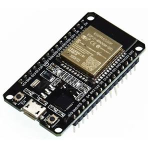 Price: ≈ $6.56/each [Datasheet](https://documentation.espressif.com/esp32-wroom-32_datasheet_en.pdf) | - Widely used and well-documented - Reliable Wi-Fi performance - Strong software ecosystem | - Older architecture compared to S3 - Fewer advanced features (USB support, improved peripherals) - Higher cost than S3 module in this case |

### Option 3

| Solution | Pros | Cons |
|----------|------|------|
| **ESP32-S3 (bare QFN chip)** 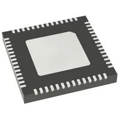 Price: ≈ $2.13/each [Datasheet](https://documentation.espressif.com/esp32-s3_datasheet_en.pdf) Standalone MCU without integrated RF module packaging | - Lowest cost per unit - Smallest PCB footprint - Maximum control over layout and antenna design | - Requires custom RF layout and impedance matching - Higher assembly difficulty (QFN package) - Increased design risk for first PCB revision |

**Choice:** Option 1 — ESP32-S3-WROOM-1-N4
**Rationale:** The ESP32-S3-WROOM-1-N4 module is selected because it provides the most reliable and low-risk solution for implementing Wi-Fi and MQTT communication in this subsystem. Since this board is responsible for two-way wireless communication, stable connectivity is critical. Using a pre-certified module significantly reduces RF design complexity compared to the bare QFN chip option.

The S3 version also provides improved performance and peripheral support compared to the classic ESP32-WROOM-32, while still remaining affordable. Its dual-core architecture allows separation of networking tasks (MQTT, telemetry, reconnection handling) from UART communication with the team daisy-chain system. Although the module has a slightly larger footprint than the bare chip, the reduction in RF tuning risk and faster bring-up time make it the optimal choice for this project.

---

## 2. 3.3 V Switching Regulator **(Power Subsystem)**

### Option 1

| Solution | Pros | Cons |
|----------|------|------|
| **AP63203WU-7** 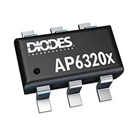 600 mA synchronous buck regulator, SOT-23-6 package, fixed 3.3V output Price: $0.71/each [Product Page](https://www.digikey.com/en/products/detail/diodes-incorporated/AP63203WU-7/9858426?gclsrc=aw.ds&gad_source=1&gad_campaignid=120565755&gbraid=0AAAAADrbLljItgRzsVnNO3-5qPvu9sOfC&gclid=Cj0KCQiAy6vMBhDCARIsAK8rOgn7K4gVE3J7ADv3_Q5YxXXt60sMg7ncnEewleIUWCqzGQ6boCWI1fQaAiB6EALw_wcB) [Datasheet](https://www.diodes.com/assets/Datasheets/AP63200-AP63201-AP63203-AP63205.pdf) | - Very compact SOT-23 package - Low cost and widely available - Simple external component requirements - Fully SMD compatible | - Moderate efficiency under higher load - Can generate noticeable heat during Wi-Fi transmit bursts - Limited current margin for future expansion |

### Option 2

| Solution | Pros | Cons |
|----------|------|------|
| **TI TPS62840DLCR** 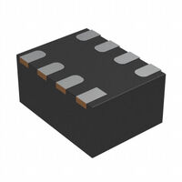 High-efficiency synchronous buck converter, optimized for low quiescent current and battery-powered systems Price: $2.08/each [Product Page](https://www.digikey.com/en/products/detail/texas-instruments/TPS62840DLCR/10445071) [Datasheet](https://www.ti.com/lit/ds/symlink/tps62840.pdf?ts=1770872928987) | - Up to 95% efficiency across wide load range - Excellent transient response for radio current spikes - Very low quiescent current (good for battery demos) - Lower heat generation compared to basic buck regulators | - Higher cost than AP63203 - Requires careful PCB layout and proper inductor selection - Slightly more complex BOM |

### Option 3

| Solution | Pros | Cons |
|----------|------|------|
| **MCP1640B Boost + LDO Combination (PMIC-style approach)** 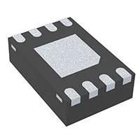 High-efficiency DC-DC converter combined with linear regulator for multi-rail designs Price: $0.81/each [Product Page](https://www.digikey.com/en/products/detail/microchip-technology/MCP1640B-I-MC/2258562) [Datasheet](https://ww1.microchip.com/downloads/aemDocuments/documents/APID/ProductDocuments/DataSheets/MCP1640-Family-Data-Sheet-DS20002234E.pdf) | - Flexible voltage configuration - Can support additional rails in future revisions - Efficient switching topology | - More complex design than needed for single 3.3V rail - Larger PCB footprint - Extra components increase layout difficulty |

**Choice:** Option 2 — TI TPS62840DLCR 
**Rationale:** The TPS62840 is selected because the ESP32’s Wi-Fi radio produces short, high-current bursts that can stress lower-efficiency regulators. A high-efficiency synchronous buck like the TPS62840 maintains a stable 3.3 V output during these transient spikes while generating significantly less heat than simpler regulators.

Although the AP63203WU-7 is more affordable and compact, its lower efficiency under heavier loads makes it less ideal for sustained wireless operation. The PMIC-style option provides flexibility but adds unnecessary complexity for a single-rail design.

By choosing the TPS62840, I improve overall power efficiency, reduce thermal risk during long demo sessions, and ensure stable operation of the ESP32 during MQTT communication and video streaming. The slightly higher cost is justified by the increased reliability and performance margin for this subsystem.

---

## 3. Power Input / Connector Strategy **(Mechanical Interface)**

### Option 1

| Solution | Pros | Cons |
|----------|------|------|
| **CUI Devices PJ-102A DC Barrel Jack (2.1mm)** 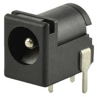 Through-hole DC barrel jack connector, 5.5mm OD / 2.1mm ID, widely used in lab power supplies Price: $0.59/each [Product Page](https://www.digikey.com/en/products/detail/same-sky-formerly-cui-devices/PJ-102A/275425) [Datasheet](https://www.sameskydevices.com/product/resource/pj-102a.pdf) | - Mechanically strong and reliable - Standard lab power connector - Compatible with common 9V wall adapters - Easy to solder and secure to PCB | - Larger footprint than USB-C - Requires external wall adapter |j

### Option 2

| Solution | Pros | Cons |
|----------|------|------|
| **USB Type-C Receptacle (GCT USB4105-GF-A)** 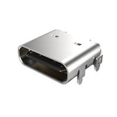 Mid-mount USB-C connector supporting up to 3A current Price: $0.78/each [Product Page](https://www.digikey.com/en/products/detail/gct/USB4105-GF-A-060/14559036?gclsrc=aw.ds&gad_source=1&gad_campaignid=17922795960&gbraid=0AAAAADrbLlhrtP8BQbzscx1ngjVZD9jvw&gclid=Cj0KCQiAy6vMBhDCARIsAK8rOglKKrvIj_LTO48MldzTyONNKZp8Gldq7_aAva31HurHPUCYSg1LSDcaApvOEALw_wcB) [Datasheet](https://gct.co/files/specs/usb4105-spec.pdf) | - Reversible and modern connector - Can support both power and data - Compact profile | - Requires CC resistors or PD controller configuration - More complex routing and ESD protection - Less mechanically robust than barrel jack in repeated demo use |

### Option 3

| Solution | Pros | Cons |
|----------|------|------|
| **JST-PH 2-Pin Connector (B2B-PH-K-S)** 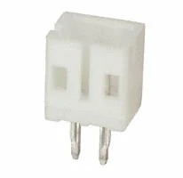 2.0mm pitch PCB header for battery connection, compact and lightweight Price: $0.10/each [Product Page](https://www.digikey.com/en/products/detail/jst-sales-america-inc/B2B-PH-K-S/926611) [Datasheet](https://www.jst-mfg.com/product/pdf/eng/ePH.pdf) | - Very compact footprint - Ideal for Li-ion battery integration - Low cost | - Not ideal for wall power supplies - Lower mechanical retention compared to barrel jack - Requires separate charging circuitry |

**Choice:** Option 1 —  CUI PJ-102A DC Barrel Jack + Board Jumpers  
**Rationale:** The DC barrel jack is selected because it aligns directly with the EGR314 project requirements, which specify the use of a barrel-jack adapter and jumper-controlled bus power integration. This ensures compatibility with standard 9V lab power supplies and simplifies system-level verification.

While USB-C offers a more modern interface, it introduces additional complexity such as configuration channel resistors, potential Power Delivery negotiation, and stricter layout requirements. For a student-built PCB focused on reliable wireless communication, that added complexity is unnecessary.

The JST battery connector is compact and useful for portable designs, but it does not meet the course expectation for wall-powered lab testing and demonstration.

By choosing the barrel jack, I ensure mechanical robustness, compliance with course standards, and straightforward hardware verification during external design review.

---

## 4. Antenna Solution **(RF Subsystem)**

### Option 1

| Solution | Pros | Cons |
|----------|------|------|
| **Johanson 2450AT18A100E Chip Antenna (2.4 GHz SMD)** 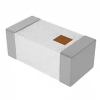 Compact 2.4 GHz surface-mount ceramic chip antenna requiring matching network Price: $0.51/each [Product Page](https://www.digikey.com/en/products/detail/johanson-technology-inc/2450AT18A0100001E/1560676) [Datasheet](https://www.johansontechnology.com/docs/1129/2450AT18A100E-AEC_tCZ7Fpd.pdf) | - Designed specifically for 2.4 GHz Wi-Fi/Bluetooth - Repeatable RF performance across builds - Small footprint and SMD compatible - Industry-standard component | - Requires proper impedance matching network - Strict PCB layout and ground keepout requirements - Slightly increases BOM count |

### Option 2

| Solution | Pros | Cons |
|----------|------|------|
| **ESP32-S3-WROOM-1-N4 Module with Integrated PCB Antenna** 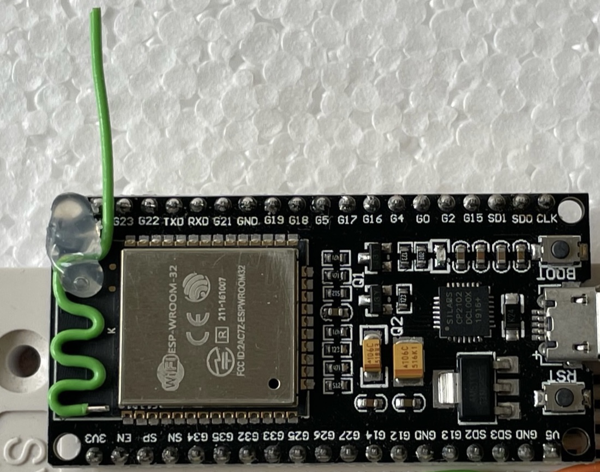 Module variant with built-in PCB trace antenna Price: Included in module cost [Product Page](https://www.digikey.com/en/products/detail/espressif-systems/ESP32-S3-WROOM-1-N4/16163950?gclsrc=aw.ds&gad_source=1&gad_campaignid=20228387720&gbraid=0AAAAADrbLljWmZW5sdxv23XwNjtDfhxpY&gclid=Cj0KCQiAy6vMBhDCARIsAK8rOgljjTSGHmiFoA02kShDemJtp7KDTSQXbjnevbEdiL1UHyt1CLWwvw0aAoDtEALw_wcB) [Datasheet](https://documentation.espressif.com/esp32-s3-wroom-1_wroom-1u_datasheet_en.pdf) | - Simplest implementation (no extra antenna component) - RF section pre-designed by manufacturer - Reduces external BOM parts | - Performance depends on host PCB placement - Must strictly follow antenna clearance recommendations - Slightly less flexible for tuning or upgrades |

### Option 3

| Solution | Pros | Cons |
|----------|------|------|
| **u.FL / IPEX Connector + External 2.4 GHz Antenna - 66089-2406** 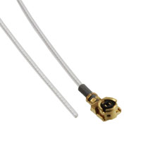 Miniature RF connector allowing detachable external antenna Price: $6.52/each (connector only) [Product Page](https://www.digikey.com/en/products/detail/ttm-technologies-inc/66089-2406/3069146?gclsrc=aw.ds&gad_source=4&gad_campaignid=20228387720&gbraid=0AAAAADrbLlj9ia03DgNl5qn3o06u1MbYB&gclid=Cj0KCQiAy6vMBhDCARIsAK8rOgkL3p0oRxP5t_KmETC8VdJauy1k2Luim1-JqPWa9Soma5K1BNc2wQkaArH8EALw_wcB) [Datasheet](https://cdn.ttm.com/repository/products/wireless-air-products/antennas/66089-2406/66089-xxxx_ProductBrief.pdf) | - Allows use of higher-gain external antennas - Easy antenna swapping during testing - Best option for maximum range | - Connector is mechanically fragile - Adds cost and PCB area - Not ideal for repeated demo handling |

**Choice:** Option 2 — ESP32-S3-WROOM Module with Integrated Antenna   
**Rationale:** The integrated PCB antenna version of the ESP32-S3-WROOM module is selected because it provides the best balance between simplicity, reliability, and reduced design risk. Since the RF portion of the antenna is already designed and tuned by Espressif, it significantly reduces the likelihood of performance issues caused by improper impedance matching or layout mistakes.

While a discrete chip antenna provides predictable and repeatable performance, it requires careful layout and a properly tuned matching network. For a first revision student PCB, minimizing RF tuning complexity reduces bring-up time and improves demo reliability.

The u.FL connector option offers flexibility and extended range, but its mechanical fragility and added cost make it less suitable for repeated handling during testing and showcase demonstrations.

Using the integrated antenna keeps the design compact, reliable, and aligned with the goal of achieving stable wireless communication with minimal RF debugging.

---

## 5. USB ↔ UART / Programming Interface **(Bring-up / OTA)**

### Option 1

| Solution | Pros | Cons |
|----------|------|------|
| **Native USB (ESP32-S3 USB D+/D− Pins)** 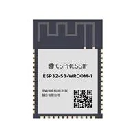 Utilizing the ESP32-S3’s built-in USB interface for programming and serial communication Price: Included in MCU cost [Product Page](https://www.digikey.com/en/products/detail/espressif-systems/ESP32-S3-WROOM-1-N4/16162639) [Datasheet](https://documentation.espressif.com/esp32-s3-wroom-1_wroom-1u_datasheet_en.pdf) | - No additional USB-UART chip required - Simplest hardware design - Supports direct flashing and serial monitor - Reduces BOM cost and PCB area | - Requires correct routing of USB differential pair - Must follow USB layout guidelines carefully - Not all module variants expose USB pins |

### Option 2

| Solution | Pros | Cons |
|----------|------|------|
| **Silicon Labs CP2102N USB-to-UART Bridge** 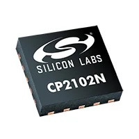 High-speed USB-to-UART bridge, widely used in development boards Price: $4.14/each [Product Page](https://www.digikey.com/en/products/detail/silicon-labs/CP2102N-A02-GQFN20/9863475?gclsrc=aw.ds&gad_source=1&gad_campaignid=20228387720&gbraid=0AAAAADrbLljWmZW5sdxv23XwNjtDfhxpY&gclid=Cj0KCQiAy6vMBhDCARIsAK8rOgkdjlkAJjjUIESdmsqvspJTJuVxKepC1Kb8Pm5R7pS_z0udVNHquGQaAlsoEALw_wcB) [Datasheet](https://www.silabs.com/documents/public/data-sheets/cp2102n-datasheet.pdf) | - Reliable and widely supported drivers - Very common in ESP32 development boards - Simple UART integration - Reduces risk if USB peripheral configuration fails | - Adds extra component and footprint - Slightly increases BOM cost - Additional routing required |

### Option 3

| Solution | Pros | Cons |
|----------|------|------|
| **2×5 Programming Header (Tag-Connect / 0.1” Header)** 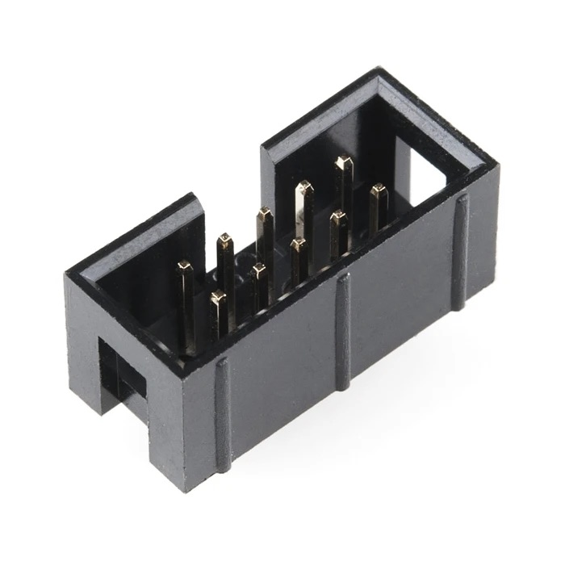 Standard programming/debug header for external USB-to-serial adapter Price: $1.80/each [Product Page](https://www.sparkfun.com/shrouded-header-pth-0-1in-2x5-pin.html) [Datasheet](https://cdn.sparkfun.com/assets/2/e/c/e/1/Shrouded-10pin.pdf) | - Very low cost - Minimal onboard components - Useful for low-level debugging | - Requires external USB-to-serial adapter - Less convenient during demos - Extra cables increase setup complexity |

**Choice:** Option 1 if module exposes USB; otherwise Option 2 — CP2102N  
**Rationale:** The preferred approach is to use the ESP32-S3’s native USB interface if the selected module exposes the required D+ and D− pins. This minimizes component count, reduces PCB area, and simplifies firmware flashing and serial debugging.

However, if USB pins are not available or routing constraints make native USB difficult, the CP2102N USB-to-UART bridge provides a highly reliable and widely supported alternative. Many ESP32 development boards use this chip, which reduces driver compatibility risks and simplifies development.

While the 2×5 programming header is inexpensive, it adds inconvenience during testing and demonstration because it requires an external adapter. For fast firmware iteration, OTA testing, and smooth TA verification, having direct USB access on the board is the most practical solution.

---

## 6. Input Protection & EMI Filtering **(Reliability)**

### Option 1

| Solution | Pros | Cons |
|----------|------|------|
| **SMBJ9.0A TVS Diode + LC Input Filter** 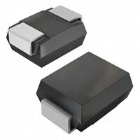 Transient Voltage Suppression diode combined with series inductor and bulk capacitor for EMI filtering TVS Price: $0.33/each [TVS Product Page](https://www.digikey.com/en/products/detail/littelfuse-inc/SMBJ9-0A/688270) [TVS Datasheet](https://www.littelfuse.com/assetdocs/tvs-diodes-smbj-series-datasheet?assetguid=ba555e99-a12d-4f72-a0b6-86b06c67171e) Inductor: $0.71/each [Inductor Product Page](https://www.digikey.com/en/products/detail/bourns-inc/SRR0603-150ML/2563518) | - Protects against voltage spikes and transients - Reduces conducted EMI from switching regulator - Improves robustness when using ribbon cable bus - Relatively low added cost | - Adds extra components to BOM - Requires careful placement near input connector |

### Option 2

| Solution | Pros | Cons |
|----------|------|------|
| **Schottky Diode + Bulk Capacitor** 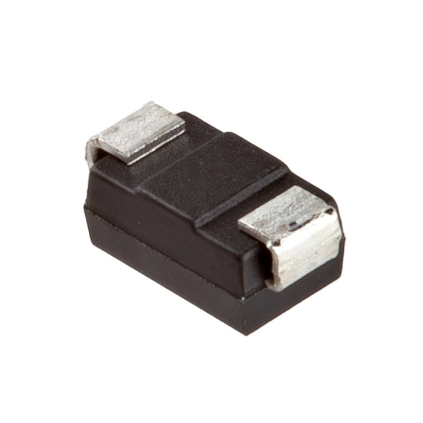 Reverse-polarity protection using Schottky diode with input capacitor filtering Diode Price: $0.25/each [Product Page](https://www.sparkfun.com/schottky-diode-40v-1a-ss14-e3-61t.html) [Datasheet](https://cdn.sparkfun.com/assets/e/d/0/b/0/SS14-E3_61T-datasheet-COM-29464.pdf) | - Very low cost solution - Simple to implement - Provides reverse polarity protection | - Does not clamp high-energy surges - Limited EMI suppression capability - Less robust for long cable runs |

### Option 3

| Solution | Pros | Cons |
|----------|------|------|
| **Pi Filter + Common-Mode Choke (WE-CNSW 744231091)** 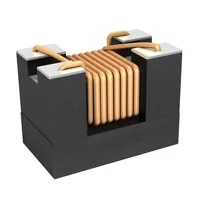 Common-mode choke combined with capacitors for strong EMI suppression Price: $1.13/each [Product Page](https://www.digikey.com/en/products/detail/w%C3%BCrth-elektronik/744231091/2650431) [Datasheet](https://www.we-online.com/components/products/datasheet/744231091.pdf) | - Excellent EMI suppression - Reduces noise coupling between boards - Useful for compliance-focused designs | - Larger footprint - Higher cost - Overkill for small low-voltage system |

**Choice:** Option 1 — TVS Diode + LC Input Filter   
**Rationale:** Since this subsystem connects to the team’s 8-wire UART daisy-chain ribbon cable, it may experience voltage transients or noise introduced by cable length and switching activity from other boards. A TVS diode provides surge suppression, while the LC filter reduces conducted EMI entering the regulator stage.

Although a simple Schottky diode is cheaper, it does not offer true surge protection. The Pi filter with common-mode choke provides excellent noise suppression but increases cost and board area beyond what is necessary for this application.

The TVS + LC combination provides a practical balance between protection, cost, and PCB complexity, improving system reliability without overcomplicating the design.

---

## 7. Testability & Debug Pads **(Manufacturability / Bring-up)**

### Option 1

| Solution | Pros | Cons |
|----------|------|------|
| **1.27 mm SMD Test Pads (Keystone 5015)** 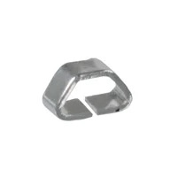 Compact surface-mount test points for probing key signals (3V3, GND, UART TX/RX, I2C, RESET) Price: $0.48/each [Product Page](https://www.digikey.com/en/products/detail/keystone-electronics/5015/278885) [Datasheet](https://www.keyelco.com/userAssets/file/M65p55.pdf) | - Enables quick voltage and signal probing - Very small PCB footprint - Ideal for production testing and debugging - Improves hardware verification efficiency | - Consumes small amount of PCB space - Requires careful silkscreen labeling |

### Option 2

| Solution | Pros | Cons |
|----------|------|------|
| **2×5 0.1” Programming Header (Samtec TSW-105-07-G-D)** 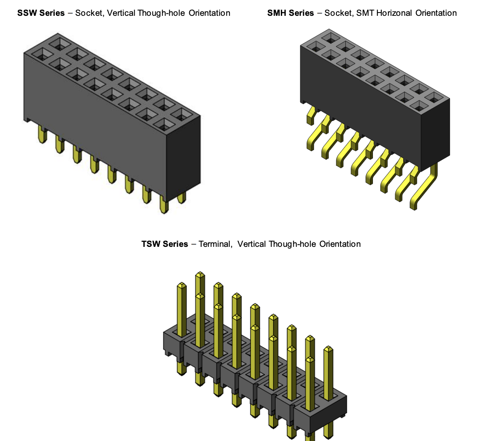 Through-hole 10-pin header for full programming and debug access Price: $0.76/each [Product Page](https://www.samtec.com/products/tsw-105-07-g-d) [Datasheet](https://suddendocs.samtec.com/productspecs/tsw-sxx.pdf?_gl=1*xh4gbm*_gcl_au*MTMwNDkyMjYzNC4xNzcwNzk1Mzc4*_ga*MTIwMDU0MzgzNy4xNzcwNzk1Mzc4*_ga_3KFNZC07WW*czE3NzA3OTUzNzgkbzEkZzAkdDE3NzA3OTUzNzgkajYwJGwwJGg2ODI1ODE2MTc.) | - Provides full programming and debugging interface - Standard 0.1” spacing for common adapters - Mechanically strong and easy to solder | - Larger footprint than SMD pads - May be redundant if native USB programming is used |

### Option 3

| Solution | Pros | Cons |
|----------|------|------|
| **Via Probes + Silkscreen Labels Only** 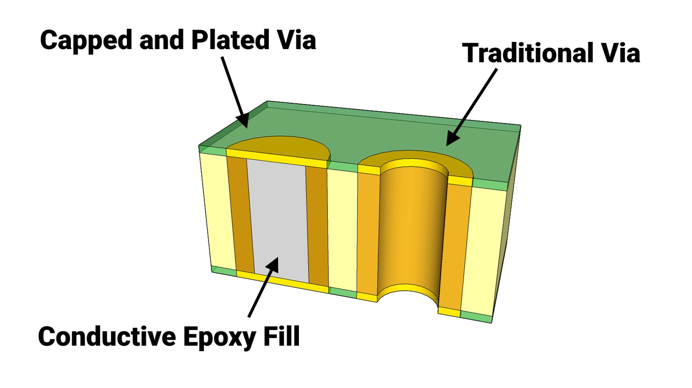 Exposed vias used as probing points without dedicated test hardware Price: No additional cost | - Minimal PCB area used - No additional BOM cost | - Harder to probe reliably - Slower debugging process - Not ideal for repeated lab testing |

**Choice:** Option 1 + Option 2 — Dedicated Test Pads and 2×5 Programming Header   
**Rationale:** For a student-designed PCB that will go through multiple debugging and verification stages, proper testability is essential. Dedicated SMD test pads allow quick measurement of power rails and communication lines during bring-up. This significantly reduces debugging time and makes hardware verification more efficient.

The 2×5 programming header provides a reliable backup interface for flashing firmware and low-level debugging, especially if USB-based flashing encounters issues. While it does consume additional PCB space, the benefit during testing and external review outweighs the minor footprint increase.

Using only exposed vias would reduce cost slightly, but it would make debugging slower and more error-prone. Since this board will be evaluated during demonstrations and design reviews, prioritizing accessibility and reliability during bring-up is the most practical approach.

---

## Final Component Selection Summary

The table below summarizes the major active components selected for Mihir's ESP32 Wireless Communication subsystem. This excludes passive components (resistors, capacitors, inductors), small matching-network components, and standard PCB hardware.

| **Subsystem**            | **Component**                               | **Manufacturer**            | **Key Specs**                                             | **Price** | **Source**  |
|--------------------------|---------------------------------------------|----------------------------|----------------------------------------------------------|-----------|------------|
| **Wireless MCU**         | ESP32-S3-WROOM-1-N4                         | Espressif Systems         | Dual-core, 4MB Flash, Wi-Fi + BLE, 3.3V logic           | $5.06     | DigiKey    |
| **3.3V Regulation**      | TPS62840DLCR                                | Texas Instruments         | 3.3V synchronous buck, up to 95% efficiency             | $2.08     | DigiKey    |
| **Power Input**          | PJ-102A Barrel Jack                         | CUI Devices               | 5.5mm x 2.1mm DC input, through-hole                    | $0.59     | DigiKey    |
| **RF Antenna**           | Integrated PCB Antenna (Module Variant)     | Espressif Systems         | 2.4 GHz Wi-Fi antenna built into module                 | Included  | DigiKey    |
| **USB Interface**        | Native USB (ESP32-S3) / CP2102N (backup)    | Espressif / Silicon Labs  | USB 2.0 interface for flashing & UART debugging         | $4.14*    | DigiKey    |
| **Input Protection**     | SMBJ9.0A TVS Diode + LC Filter              | Littelfuse + Bourns       | Surge suppression + EMI filtering                       | ~$1.04    | DigiKey    |
| **Debug Interface**      | Keystone 5015 Test Pads + 2×5 Header        | Keystone / Samtec         | SMD test points + 0.1” programming header               | ~$1.24    | DigiKey    |

\*Only required if native USB routing is not used.

---

**Estimated Total Core Component Cost: ≈ $14 - $16 per board**  
(excluding passives, PCB fabrication, shipping, and optional USB-UART redundancy)

---

### Cost Discussion

The total cost remains relatively low for a Wi-Fi-enabled communication subsystem. The ESP32 module represents the largest cost contributor, which is expected due to its integrated wireless capabilities. The high-efficiency regulator slightly increases cost compared to lower-end buck converters, but it significantly improves thermal performance and reliability during Wi-Fi transmission bursts.

Protection components and debug hardware add minimal cost while greatly improving robustness and ease of verification. Overall, the design balances cost, performance, reliability, and manufacturability in alignment with course requirements and system-level reliability goals.
