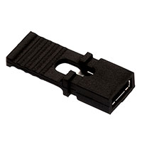
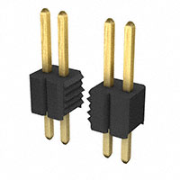
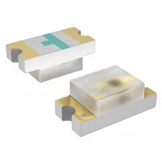

# ESP32 Wireless Communication — Component Selection  

## 1. Wireless MCU / Wi-Fi Module **(Core Subsystem)**

### Option 1

| Solution | Pros | Cons |
|----------|------|------|
| **ESP32-S3-WROOM-1-N4 (SMD module)**  Surface-mount module with integrated RF, 4MB flash, dual-core CPU Price: ≈ $5.06/each [Product Page](https://www.digikey.com/en/products/detail/espressif-systems/ESP32-S3-WROOM-1-N4/16162639) [Datasheet](https://documentation.espressif.com/esp32-s3-wroom-1_wroom-1u_datasheet_en.pdf) | - Integrated Wi-Fi and Bluetooth - Dual-core processor allows multitasking (MQTT + UART) - Large community support and example libraries - RF section already optimized inside module | - Slightly larger footprint than bare chip - Requires antenna keepout area on PCB |

### Option 2

| Solution | Pros | Cons |
|----------|------|------|
| **ESP32-WROOM (classic)**  Price: ≈ $6.56/each [Datasheet](https://documentation.espressif.com/esp32-wroom-32_datasheet_en.pdf) | - Widely used and well-documented - Reliable Wi-Fi performance - Strong software ecosystem | - Older architecture compared to S3 - Fewer advanced features (USB support, improved peripherals) - Higher cost than S3 module in this case |

### Option 3

| Solution | Pros | Cons |
|----------|------|------|
| **ESP32-S3 (bare QFN chip)**  Price: ≈ $2.13/each [Datasheet](https://documentation.espressif.com/esp32-s3_datasheet_en.pdf) Standalone MCU without integrated RF module packaging | - Lowest cost per unit - Smallest PCB footprint - Maximum control over layout and antenna design | - Requires custom RF layout and impedance matching - Higher assembly difficulty (QFN package) - Increased design risk for first PCB revision |

**Choice:** Option 1 — ESP32-S3-WROOM-1-N4
**Rationale:** The ESP32-S3-WROOM-1-N4 module is selected because it provides the most reliable and low-risk solution for implementing Wi-Fi and MQTT communication in this subsystem. Since this board is responsible for two-way wireless communication, stable connectivity is critical. Using a pre-certified module significantly reduces RF design complexity compared to the bare QFN chip option.

The S3 version also provides improved performance and peripheral support compared to the classic ESP32-WROOM-32, while still remaining affordable. Its dual-core architecture allows separation of networking tasks (MQTT, telemetry, reconnection handling) from UART communication with the team daisy-chain system. Although the module has a slightly larger footprint than the bare chip, the reduction in RF tuning risk and faster bring-up time make it the optimal choice for this project.

---

## 2. 3.3 V Switching Regulator **(Power Subsystem)**

### Option 1

| Solution | Pros | Cons |
|----------|------|------|
| **AP63203WU-7**  600 mA synchronous buck regulator, SOT-23-6 package, fixed 3.3V output Price: $0.71/each [Product Page](https://www.digikey.com/en/products/detail/diodes-incorporated/AP63203WU-7/9858426?gclsrc=aw.ds&gad_source=1&gad_campaignid=120565755&gbraid=0AAAAADrbLljItgRzsVnNO3-5qPvu9sOfC&gclid=Cj0KCQiAy6vMBhDCARIsAK8rOgn7K4gVE3J7ADv3_Q5YxXXt60sMg7ncnEewleIUWCqzGQ6boCWI1fQaAiB6EALw_wcB) [Datasheet](https://www.diodes.com/assets/Datasheets/AP63200-AP63201-AP63203-AP63205.pdf) | - Very compact SOT-23 package - Low cost and widely available - Simple external component requirements - Fully SMD compatible | - Moderate efficiency under higher load - Can generate noticeable heat during Wi-Fi transmit bursts - Limited current margin for future expansion |

### Option 2

| Solution | Pros | Cons |
|----------|------|------|
| **TI TPS62840DLCR**  High-efficiency synchronous buck converter, optimized for low quiescent current and battery-powered systems Price: $2.08/each [Product Page](https://www.digikey.com/en/products/detail/texas-instruments/TPS62840DLCR/10445071) [Datasheet](https://www.ti.com/lit/ds/symlink/tps62840.pdf?ts=1770872928987) | - Up to 95% efficiency across wide load range - Excellent transient response for radio current spikes - Very low quiescent current (good for battery demos) - Lower heat generation compared to basic buck regulators | - Higher cost than AP63203 - Requires careful PCB layout and proper inductor selection - Slightly more complex BOM |

### Option 3

| Solution | Pros | Cons |
|----------|------|------|
| **MCP1640B Boost + LDO Combination (PMIC-style approach)**  High-efficiency DC-DC converter combined with linear regulator for multi-rail designs Price: $0.81/each [Product Page](https://www.digikey.com/en/products/detail/microchip-technology/MCP1640B-I-MC/2258562) [Datasheet](https://ww1.microchip.com/downloads/aemDocuments/documents/APID/ProductDocuments/DataSheets/MCP1640-Family-Data-Sheet-DS20002234E.pdf) | - Flexible voltage configuration - Can support additional rails in future revisions - Efficient switching topology | - More complex design than needed for single 3.3V rail - Larger PCB footprint - Extra components increase layout difficulty |

**Choice:** Option 1 — AP63203WU-7
**Rationale:** I chose the AP63203WU-7 because it keeps the power circuit simple while still meeting the current requirements of the ESP32-S3. The fixed 3.3V output means I don't need to calculate or place feedback resistors, the datasheet application circuit is just an inductor and two capacitors, which is exactly what's shown in my schematic. At 600 mA output, it comfortably handles the ESP32's typical operating current with enough headroom for Wi-Fi bursts.

I did consider the TPS62840 for its higher efficiency, but after looking at the numbers, the AP63203 is more than adequate for this design. The ESP32-S3 draws around 250–350 mA during active Wi-Fi transmission, which is well within the AP63203's rating. The efficiency difference doesn't justify paying three times the price, especially since this board will mostly be powered from a bench supply during demos rather than running on battery. The MCP1640B is a boost converter, which steps voltage up, so it simply can't be used to regulate down from 9V, that option was eliminated right away.

---

## 3. Power Input / Connector Strategy **(Mechanical Interface)**

### Option 1

| Solution | Pros | Cons |
|----------|------|------|
| **CUI Devices PJ-102A DC Barrel Jack (2.1mm)**  Through-hole DC barrel jack connector, 5.5mm OD / 2.1mm ID, widely used in lab power supplies Price: $0.59/each [Product Page](https://www.digikey.com/en/products/detail/same-sky-formerly-cui-devices/PJ-102A/275425) [Datasheet](https://www.sameskydevices.com/product/resource/pj-102a.pdf) | - Mechanically strong and reliable - Standard lab power connector - Compatible with common 9V wall adapters - Easy to solder and secure to PCB | - Larger footprint than USB-C - Requires external wall adapter |j

### Option 2

| Solution | Pros | Cons |
|----------|------|------|
| **USB Type-C Receptacle (GCT USB4105-GF-A)**  Mid-mount USB-C connector supporting up to 3A current Price: $0.78/each [Product Page](https://www.digikey.com/en/products/detail/gct/USB4105-GF-A-060/14559036?gclsrc=aw.ds&gad_source=1&gad_campaignid=17922795960&gbraid=0AAAAADrbLlhrtP8BQbzscx1ngjVZD9jvw&gclid=Cj0KCQiAy6vMBhDCARIsAK8rOglKKrvIj_LTO48MldzTyONNKZp8Gldq7_aAva31HurHPUCYSg1LSDcaApvOEALw_wcB) [Datasheet](https://gct.co/files/specs/usb4105-spec.pdf) | - Reversible and modern connector - Can support both power and data - Compact profile | - Requires CC resistors or PD controller configuration - More complex routing and ESD protection - Less mechanically robust than barrel jack in repeated demo use |

### Option 3

| Solution | Pros | Cons |
|----------|------|------|
| **JST-PH 2-Pin Connector (B2B-PH-K-S)**  2.0mm pitch PCB header for battery connection, compact and lightweight Price: $0.10/each [Product Page](https://www.digikey.com/en/products/detail/jst-sales-america-inc/B2B-PH-K-S/926611) [Datasheet](https://www.jst-mfg.com/product/pdf/eng/ePH.pdf) | - Very compact footprint - Ideal for Li-ion battery integration - Low cost | - Not ideal for wall power supplies - Lower mechanical retention compared to barrel jack - Requires separate charging circuitry |

**Choice:** Option 1 —  CUI PJ-102A DC Barrel Jack + Board Jumpers  
**Rationale:** The DC barrel jack is selected because it aligns directly with the EGR314 project requirements, which specify the use of a barrel-jack adapter and jumper-controlled bus power integration. This ensures compatibility with standard 9V lab power supplies and simplifies system-level verification.

While USB-C offers a more modern interface, it introduces additional complexity such as configuration channel resistors, potential Power Delivery negotiation, and stricter layout requirements. For a student-built PCB focused on reliable wireless communication, that added complexity is unnecessary.

The JST battery connector is compact and useful for portable designs, but it does not meet the course expectation for wall-powered lab testing and demonstration.

By choosing the barrel jack, I ensure mechanical robustness, compliance with course standards, and straightforward hardware verification during external design review.

---

## 4. Antenna Solution **(RF Subsystem)**

### Option 1

| Solution | Pros | Cons |
|----------|------|------|
| **Johanson 2450AT18A100E Chip Antenna (2.4 GHz SMD)**  Compact 2.4 GHz surface-mount ceramic chip antenna requiring matching network Price: $0.51/each [Product Page](https://www.digikey.com/en/products/detail/johanson-technology-inc/2450AT18A0100001E/1560676) [Datasheet](https://www.johansontechnology.com/docs/1129/2450AT18A100E-AEC_tCZ7Fpd.pdf) | - Designed specifically for 2.4 GHz Wi-Fi/Bluetooth - Repeatable RF performance across builds - Small footprint and SMD compatible - Industry-standard component | - Requires proper impedance matching network - Strict PCB layout and ground keepout requirements - Slightly increases BOM count |

### Option 2

| Solution | Pros | Cons |
|----------|------|------|
| **ESP32-S3-WROOM-1-N4 Module with Integrated PCB Antenna**  Module variant with built-in PCB trace antenna Price: Included in module cost [Product Page](https://www.digikey.com/en/products/detail/espressif-systems/ESP32-S3-WROOM-1-N4/16163950?gclsrc=aw.ds&gad_source=1&gad_campaignid=20228387720&gbraid=0AAAAADrbLljWmZW5sdxv23XwNjtDfhxpY&gclid=Cj0KCQiAy6vMBhDCARIsAK8rOgljjTSGHmiFoA02kShDemJtp7KDTSQXbjnevbEdiL1UHyt1CLWwvw0aAoDtEALw_wcB) [Datasheet](https://documentation.espressif.com/esp32-s3-wroom-1_wroom-1u_datasheet_en.pdf) | - Simplest implementation (no extra antenna component) - RF section pre-designed by manufacturer - Reduces external BOM parts | - Performance depends on host PCB placement - Must strictly follow antenna clearance recommendations - Slightly less flexible for tuning or upgrades |

### Option 3

| Solution | Pros | Cons |
|----------|------|------|
| **u.FL / IPEX Connector + External 2.4 GHz Antenna - 66089-2406**  Miniature RF connector allowing detachable external antenna Price: $6.52/each (connector only) [Product Page](https://www.digikey.com/en/products/detail/ttm-technologies-inc/66089-2406/3069146?gclsrc=aw.ds&gad_source=4&gad_campaignid=20228387720&gbraid=0AAAAADrbLlj9ia03DgNl5qn3o06u1MbYB&gclid=Cj0KCQiAy6vMBhDCARIsAK8rOgkL3p0oRxP5t_KmETC8VdJauy1k2Luim1-JqPWa9Soma5K1BNc2wQkaArH8EALw_wcB) [Datasheet](https://cdn.ttm.com/repository/products/wireless-air-products/antennas/66089-2406/66089-xxxx_ProductBrief.pdf) | - Allows use of higher-gain external antennas - Easy antenna swapping during testing - Best option for maximum range | - Connector is mechanically fragile - Adds cost and PCB area - Not ideal for repeated demo handling |

**Choice:** Option 2 — ESP32-S3-WROOM Module with Integrated Antenna   
**Rationale:** The integrated PCB antenna version of the ESP32-S3-WROOM module is selected because it provides the best balance between simplicity, reliability, and reduced design risk. Since the RF portion of the antenna is already designed and tuned by Espressif, it significantly reduces the likelihood of performance issues caused by improper impedance matching or layout mistakes.

While a discrete chip antenna provides predictable and repeatable performance, it requires careful layout and a properly tuned matching network. For a first revision student PCB, minimizing RF tuning complexity reduces bring-up time and improves demo reliability.

The u.FL connector option offers flexibility and extended range, but its mechanical fragility and added cost make it less suitable for repeated handling during testing and showcase demonstrations.

Using the integrated antenna keeps the design compact, reliable, and aligned with the goal of achieving stable wireless communication with minimal RF debugging.

---

## 5. USB ↔ UART / Programming Interface **(Bring-up / OTA)**

### Option 1

| Solution | Pros | Cons |
|----------|------|------|
| **Native USB (ESP32-S3 USB D+/D− Pins)**  Utilizing the ESP32-S3’s built-in USB interface for programming and serial communication Price: Included in MCU cost [Product Page](https://www.digikey.com/en/products/detail/espressif-systems/ESP32-S3-WROOM-1-N4/16162639) [Datasheet](https://documentation.espressif.com/esp32-s3-wroom-1_wroom-1u_datasheet_en.pdf) | - No additional USB-UART chip required - Simplest hardware design - Supports direct flashing and serial monitor - Reduces BOM cost and PCB area | - Requires correct routing of USB differential pair - Must follow USB layout guidelines carefully - Not all module variants expose USB pins |

### Option 2

| Solution | Pros | Cons |
|----------|------|------|
| **Silicon Labs CP2102N USB-to-UART Bridge**  High-speed USB-to-UART bridge, widely used in development boards Price: $4.14/each [Product Page](https://www.digikey.com/en/products/detail/silicon-labs/CP2102N-A02-GQFN20/9863475?gclsrc=aw.ds&gad_source=1&gad_campaignid=20228387720&gbraid=0AAAAADrbLljWmZW5sdxv23XwNjtDfhxpY&gclid=Cj0KCQiAy6vMBhDCARIsAK8rOgkdjlkAJjjUIESdmsqvspJTJuVxKepC1Kb8Pm5R7pS_z0udVNHquGQaAlsoEALw_wcB) [Datasheet](https://www.silabs.com/documents/public/data-sheets/cp2102n-datasheet.pdf) | - Reliable and widely supported drivers - Very common in ESP32 development boards - Simple UART integration - Reduces risk if USB peripheral configuration fails | - Adds extra component and footprint - Slightly increases BOM cost - Additional routing required |

### Option 3

| Solution | Pros | Cons |
|----------|------|------|
| **2×5 Programming Header (Tag-Connect / 0.1” Header)**  Standard programming/debug header for external USB-to-serial adapter Price: $1.80/each [Product Page](https://www.sparkfun.com/shrouded-header-pth-0-1in-2x5-pin.html) [Datasheet](https://cdn.sparkfun.com/assets/2/e/c/e/1/Shrouded-10pin.pdf) | - Very low cost - Minimal onboard components - Useful for low-level debugging | - Requires external USB-to-serial adapter - Less convenient during demos - Extra cables increase setup complexity |

**Choice:** Option 1 — Micro USB SMD Connector (Native USB)  
**Rationale:** The Micro USB connector serves two purposes on my board, it acts as a secondary power input through VBUS (protected by a Schottky diode D7 so it doesn't fight with the barrel jack), and it's the primary way I'll be flashing firmware using the ESP32-S3's native USB pins. Because the S3 already has USB D+ and D− built in, I don't need a separate USB-to-UART chip at all. That saves me a chip, the routing that comes with it, and about $4 off the BOM.

I looked at using USB-C with a CP2102N bridge, which is how a lot of commercial ESP32 boards are designed, but it felt like overkill here. The CP2102N works great, but it adds another IC to place and route, and since the S3 natively supports USB, it's just extra complexity for no real benefit. The 2×5 header-only option was the other end of the spectrum -  cheaper, but requiring an external adapter every time I want to flash code is something I didn't want to deal with, especially during back-to-back verification sessions. Having the USB connector directly on the board is just much more convenient.

---

## 6. Input Protection & EMI Filtering **(Reliability)**

### Option 1

| Solution | Pros | Cons |
|----------|------|------|
| **SMBJ9.0A TVS Diode + LC Input Filter**  Transient Voltage Suppression diode combined with series inductor and bulk capacitor for EMI filtering TVS Price: $0.33/each [TVS Product Page](https://www.digikey.com/en/products/detail/littelfuse-inc/SMBJ9-0A/688270) [TVS Datasheet](https://www.littelfuse.com/assetdocs/tvs-diodes-smbj-series-datasheet?assetguid=ba555e99-a12d-4f72-a0b6-86b06c67171e) Inductor: $0.71/each [Inductor Product Page](https://www.digikey.com/en/products/detail/bourns-inc/SRR0603-150ML/2563518) | - Protects against voltage spikes and transients - Reduces conducted EMI from switching regulator - Improves robustness when using ribbon cable bus - Relatively low added cost | - Adds extra components to BOM - Requires careful placement near input connector |

### Option 2

| Solution | Pros | Cons |
|----------|------|------|
| **Schottky Diode + Polyfuse**  Schottky diode for reverse polarity/path isolation + resettable polyfuse for overcurrent Diode Price: $0.25/each [Product Page](https://www.sparkfun.com/schottky-diode-40v-1a-ss14-e3-61t.html) [Datasheet](https://cdn.sparkfun.com/assets/e/d/0/b/0/SS14-E3_61T-datasheet-COM-29464.pdf) | - Simple and low cost - Schottky provides reverse polarity and path-OR protection - Polyfuse is resettable, no need to replace blown fuses during testing - Widely understood and easy to debug | - Schottky has a small forward voltage drop (~0.3V) - Polyfuse has some resistance and may trip under high transient load |

### Option 3

| Solution | Pros | Cons |
|----------|------|------|
| **Pi Filter + Common-Mode Choke (WE-CNSW 744231091)**  Common-mode choke combined with capacitors for strong EMI suppression Price: $1.13/each [Product Page](https://www.digikey.com/en/products/detail/w%C3%BCrth-elektronik/744231091/2650431) [Datasheet](https://www.we-online.com/components/products/datasheet/744231091.pdf) | - Excellent EMI suppression - Reduces noise coupling between boards - Useful for compliance-focused designs | - Larger footprint - Higher cost - Overkill for small low-voltage system |

**Choice:** Option 2 — Schottky Diode (D_Shockley) + Polyfuse (F1)   
**Rationale:** I went with a Schottky diode and polyfuse combination because it covers the two most likely failure scenarios during development, accidental reverse polarity and overcurrent from a short circuit, without overcomplicating the design. The Schottky diode on the barrel jack input (D1) blocks reverse voltage if the supply is plugged in backwards, which is an easy mistake to make in a busy lab. It also does the power-path OR-ing between the barrel jack and USB VBUS so both supplies can be connected at the same time without one backfeeding the other. The polyfuse F1 handles overcurrent, if something on the board shorts during bring-up, the fuse trips and resets itself once the fault is cleared, so I don't have to dig through a parts drawer to replace a blown fuse mid-session.

The TVS diode option is better for protecting against voltage spikes on long cable runs, which isn't really the concern here since we're running off a regulated bench supply. The common-mode choke would help with EMI, but for a 9V/3.3V low-frequency system it's completely unnecessary and adds cost and footprint. The Schottky + polyfuse approach is simple, proven, and practical for a student lab environment.

---

## 6. Power Path Jumpers (Bus Power Control)

### Option 1

| Solution | Pros | Cons |
|----------|------|------|
| **2-Position 2.54mm Jumper (Wurth 732-13618-ND)**  Standard 2-pin shorting jumper, 2.54mm pitch Price: ~$0.35/each [Product Page](https://www.digikey.com/en/products/detail/w%C3%BCrth-elektronik/609002115121/9920882?s=N4IgTCBcDaIOoFcBOAXAFgAgOwGYwFoBGHANkIA58A5AERAF0BfIA) [Datasheet](https://www.we-online.com/components/products/datasheet/609002115121.pdf) | - Fulfills EGR314 required jumper specification directly - Standard 0.1" pitch — easy to manually place/remove - Extremely low cost - No tools needed for reconfiguration | - Manual operation only (not software switchable) - Small size can be lost during lab sessions |

### Option 2

| Solution | Pros | Cons |
|----------|------|------|
| **SPDT Slide Switch** Small SMD slide switch for bus power toggling Price: ~$0.40–$0.80/each | - Stays in set position without falling off - More user-friendly than removable jumpers | - Larger footprint than a 2-pin header - Not the standard EGR314 jumper approach - Harder to source in SMD form |

### Option 3

| Solution | Pros | Cons |
|----------|------|------|
| **P-channel MOSFET Power Switch** Soft-switching via GPIO control Price: ~$0.50–$1.00/each | - Software controllable - No manual intervention needed | - Significantly more complex — gate driver, pull resistors needed - Overkill for a simple power isolation requirement - Not aligned with course specification |

**Choice:** Option 1 — Wurth 732-13618-ND 2-Position Jumper  
**Rationale:** The course spec explicitly requires two jumpers per board, one to connect or disconnect bus power from the regulator, and one to connect or disconnect the barrel jack from the bus. The Wurth 732-13618-ND is a standard 2.54mm shorting jumper that fits a regular 2-pin header, so it satisfies that requirement directly with no fuss. Being able to physically remove a jumper to isolate my board from the team bus is really useful during debugging, because it means I can test my subsystem independently before connecting it to everyone else's hardware.

A slide switch would also work, but it takes up more PCB space and isn't the typical way jumpers are implemented in EGR314 designs. A MOSFET-based software switch could do the same thing and add remote controllability, but that would need a gate driver circuit, pull resistors, and firmware support, way more complexity than what this requirement calls for. A simple removable jumper does the job perfectly.

---

## 7. GPIO Headers & Expansion Pins (Connectivity)

### Option 1

| Solution | Pros | Cons |
|----------|------|------|
| **Harwin M52-040023V2045 (2×10, 1.27mm pitch SMD)**  SMD vertical header, 20-pin, 1.27mm pitch Price: ~$2.94/each [Product Page](https://www.digikey.com/en/products/detail/harwin-inc/M52-040023V2045/6797702?s=N4IgTCBcDaILIFYwFoAMAWVqwGYBqYGCIAugL5A) [Datasheet](https://content.harwin.com/m/d0f746354cedd7a4/original/PD002-Product-Datasheet-ARCHER-M50-and-M52-ranges-BBi.pdf) | - Compact 1.27mm pitch saves PCB area - SMD compatible — no drilling required - Provides access to ESP32 GPIO, UART, and debug pins - Sufficient pin count for all required signals | - Smaller pitch requires careful soldering - Not compatible with standard 0.1" breadboard jumpers |

### Option 2

| Solution | Pros | Cons |
|----------|------|------|
| **Standard 2.54mm Through-Hole Pin Header (1×10 or 2×5)** Price: ~$0.20–$0.40/each | - Universal 0.1" pitch — works with standard jumper wires - Easy to hand solder | - Larger PCB footprint - Through-hole requires drilling in PCB - Less professional appearance for a compact SMD design |

### Option 3

| Solution | Pros | Cons |
|----------|------|------|
| **No Expansion Headers (Direct Trace Routing Only)** Price: $0 | - Minimum PCB area used - Cleanest board layout | - No external probe access to GPIO signals - Makes debugging extremely difficult - Fails to support team integration requirements |

**Choice:** Option 1 — Harwin M52-040023V2045  
**Rationale:** I chose the Harwin M52-040023V2045 because it gives me a way to break out the key GPIO signals I need, RX/TX, UART daisy chain lines, BOOT, ENABLE, and some spare pins, in a compact SMD footprint that keeps the board looking clean. The 1.27mm pitch is smaller than a standard 0.1" header, but it's still solderable by hand and the pin count is enough to expose everything I need without running out of space.

Standard through-hole 0.1" headers would definitely be easier to plug jumper wires into, but they require drilling the PCB and take up significantly more area. For a subsystem board that's already fairly busy with the ESP32 module, regulator, protection circuitry, and connectors, saving that space matters. Leaving out expansion headers entirely wasn't really an option either, without them, it would be very difficult to probe signals or connect to teammate boards during integration, which would slow down the whole team's verification process.

---

## 8. Daisy Chain Connectors (Upstream / Downstream)

### Option 1

| Solution | Pros | Cons |
|----------|------|------|
| **2×4 IDC Female Header (8-pin, 2.54mm pitch)** Standard 8-wire ribbon cable IDC connector for EGR314 daisy chain bus Price: ~$0.50–$0.80/each [Product Page](https://www.digikey.com/en/products/detail/marutsuelec/21602X40GSE/21669085) [Datasheet](https://www.marutsu.co.jp/contents/shop/marutsu/datasheet/2160.pdf) | - Directly specified by EGR314 project requirements - Keyed IDC connector prevents incorrect insertion - Compatible with standard ribbon cable assemblies - Provides all required pins: VCC, GND, UART TX/RX, and extra GPIO | - Through-hole mounting required - Slightly larger footprint than custom connectors |
### Option 2

| Solution | Pros | Cons |
|----------|------|------|
| **JST-XH 8-Pin Connector** Price: ~$0.30/each | - Compact and lightweight - Secure locking mechanism | - Not the EGR314 specified connector standard - Not compatible with team ribbon cable assemblies - Would require custom cables |

### Option 3

| Solution | Pros | Cons |
|----------|------|------|
| **Screw Terminal Block (8-pin)** Price: ~$1.00/each | - Very robust mechanical connection - Easy wire attachment | - Very large PCB footprint - Not IDC ribbon cable compatible - Does not meet course connector standard |

**Choice:** Option 1 — 2×4 IDC Female Header (8-pin)  
**Rationale:** This one was basically decided by the course spec. EGR314 requires all boards to use an 8-wire ribbon cable with a 2×4 IDC female header for the daisy chain network, so using anything else would mean my board can't physically connect to my teammates' boards. I have two of these, one for the upstream connection (Connector In) and one for the downstream connection (Connector Out) — which matches the layout shown in the class daisy chain diagram.

JST connectors are nice for compact designs but they aren't IDC ribbon-compatible, so the whole team would need custom cables just for my board, which isn't practical. Screw terminals are extremely bulky and also incompatible with ribbon cables. There really wasn't a decision to make here, the 2×4 IDC header is the only option that keeps my board compatible with the rest of the system.

---

## 9. Status & Debug LEDs (Testability)

### Option 1

| Solution | Pros | Cons |
|----------|------|------|
| **SMD LED 0805 Green Diffused (ams-OSRAM)**  Standard green SMD LED, 0805 package Price: ~$0.15/each [Product Page](https://www.digikey.com/en/products/detail/ams-osram-usa-inc/LG-R971-KN-1-0-20-R18/1227925?s=N4IgTCBcDaICwHYCsBaAMgcQEoE4EEYUBrAOxXwGEAVFAOQBEQBdAXyA) [Datasheet](https://look.ams-osram.com/m/2da6f2ceeebf8fac/original/LG-R971.pdf) | - Small 0805 footprint — easy to hand solder - Standard current requirements (10–20mA) work with 220Ω resistor at 3.3V - Bright enough for lab visibility - Low cost per unit | - Only one color — less informative for multi-state debug |

### Option 2

| Solution | Pros | Cons |
|----------|------|------|
| **RGB SMD LED (Common Cathode)** Price: ~$0.50–$1.00/each | - Multiple colors allow distinct status indication - Single LED replaces 3 status LEDs | - Requires 3 GPIO pins per LED - More complex firmware - Higher cost |

### Option 3

| Solution | Pros | Cons |
|----------|------|------|
| **WS2812B Addressable LED** Price: ~$0.30/each | - Single-wire control for full color - Chainable | - Requires specific timing protocol - Overkill for basic status indication - More complex firmware overhead |

**Choice:** Option 1 — Green SMD LED 0805 (×5)  
**Rationale:** I'm using five green 0805 LEDs spread across the board for different debug purposes, two are tied to the RX and TX test points (pins 41 and 40) so I can visually confirm data is flowing through the UART lines, and the others give me status feedback for various GPIO states. The 0805 package is small enough to fit comfortably on the board but still large enough to solder by hand without too much difficulty, and a simple 220Ω current-limiting resistor at 3.3V keeps each one in the right operating range.

RGB LEDs would be cool for showing different states with different colors, but each one would need three separate GPIO pins and more complex firmware logic to control. That's a lot of overhead for what is basically a debugging aid. WS2812B addressable LEDs are even more involved, they need a specific single-wire timing protocol and their own power filtering. Both options are overkill for this use case. Simple green LEDs tell me what I need to know during bring-up and verification without adding any complexity to the firmware or the schematic.

---

## 10. Tactile Buttons (User Input)

### Option 1

| Solution | Pros | Cons |
|----------|------|------|
| **CTS 222AMVBAR SPST-NO Tactile Switch (SMD)** Top-actuated surface-mount tactile switch Price: $0.22/each — SPST-NO, 12 V, 0.05 A rating [Product Page](https://www.digikey.com/en/products/detail/cts-electrocomponents/222AMVBAR/5227982) | - Surface-mount gull-wing — fits cleanly on PCB - Excellent tactile feedback and reliable operation - Compact footprint - 12V rated, well above 3.3V logic requirements | - Still a small surface switch — may be slightly harder to press than a larger thru-hole button |

### Option 2

| Solution | Pros | Cons |
|----------|------|------|
| **Through-hole 6 mm Tactile Push Button** Price: ~$0.15/each | - Larger button surface — easier to press - Very widely available | - Through-hole requires PCB drilling - Taller profile |

### Option 3

| Solution | Pros | Cons |
|----------|------|------|
| **Capacitive Touch Pad (Standalone IC)** Price: ~$1.00–$2.00/each | - No mechanical parts — higher longevity - Modern interface | - Requires additional IC and firmware driver - Susceptible to false triggers in lab EMI environment - Overkill for boot/enable functions |

**Choice:** Option 1 — CTS 222AMVBAR SPST-NO Tactile Switch (×2)  
**Rationale:** I need two buttons on this board — one for BOOT to put the ESP32 into download mode, and one for ENABLE to manually reset it. I went with the CTS 222AMVBAR because it's a compact top-actuated SMD switch with solid tactile feedback, and its gull-wing footprint integrates cleanly onto the PCB without needing any drilled holes. The 0.05A, 12V rating is way more than needed for a 3.3V GPIO input, so there's no concern about it being underspecced for this application. Each switch is paired with a 470Ω pull-up resistor to 3.3V and a 0.1µF decoupling capacitor to GND, which is the standard ESP32 boot and reset button circuit.

Through-hole buttons would honestly be a bit easier to press during demos since the surface area is bigger, but they require drilling the PCB and sit noticeably taller than the rest of the surface-mount components, which I wanted to avoid. Capacitive touch is an interesting option in theory, but it needs a dedicated controller IC, firmware driver, and is well known for being sensitive to RF noise, which is a real concern on a board that's actively running Wi-Fi. For two simple pushbuttons, there's no reason to add that complexity.

---

# Final Component Selection Summary

The table below summarizes the major components selected for the ESP32 Wireless Communication subsystem.  
This excludes passive components (resistors, capacitors, inductors) and standard PCB hardware.

| Subsystem | Component | Manufacturer | Key Specs | Price | Source |
|------------|------------|---------------|------------|--------|--------|
| **Wireless MCU** | ESP32-S3-WROOM-1-N4 | Espressif Systems | Dual-core, 4MB Flash, Wi-Fi + BLE, native USB D+/D− | $5.06 | DigiKey |
| **3.3V Regulation** | AP63203WU-7 | Diodes Incorporated | 600mA synchronous buck, SOT-23-6, fixed 3.3V output | $0.71 | DigiKey |
| **Primary Power** | PJ-102A Barrel Jack | CUI Devices (Same Sky) | 5.5mm × 2.1mm DC input, through-hole, 9V supply | $0.59 | DigiKey |
| **Secondary Power / Programming** | Micro USB SMD Connector | GCT | USB_B_Micro, VBUS backup power + native ESP32 USB flashing | ~$0.60 | DigiKey |
| **RF Antenna** | Integrated PCB Antenna (Module) | Espressif Systems | 2.4 GHz Wi-Fi antenna built into WROOM module | Included | DigiKey |
| **Input Protection** | Schottky Diode + 2.5A Polyfuse | onsemi + Littelfuse | Reverse polarity protection + resettable overcurrent fuse | ~$0.69 | DigiKey |
| **Bus Power Jumpers** | Wurth 732-13618-ND | Wurth Elektronik | 2-pos 2.54mm shorting jumper ×2 (bus + barrel jack isolation) | ~$0.35 ea | DigiKey |
| **GPIO Headers** | Harwin M52-040023V2045 | Harwin Inc | 20-pin SMD, 1.27mm pitch, UART + GPIO breakout | ~$2.94 | DigiKey |
| **Daisy Chain Connectors** | 2×4 IDC Female Header | Marutsuelec | 8-pin, 2.54mm pitch, ribbon cable compatible ×2 | ~$0.65 ea | DigiKey |
| **Status / Debug LEDs** | Green SMD LED 0805 (LG-R971) | ams-OSRAM | 0805, ~20mA, RX/TX indicators + GPIO status ×5 | ~$0.15 ea | DigiKey |
| **Tactile Buttons** | CTS 222AMVBAR | CTS Electrocomponents | SPST-NO, 0.05A 12V, gull-wing SMD ×2 (BOOT + ENABLE) | ~$0.22 ea | DigiKey |

---

## Estimated Total Core Component Cost

**≈ 13 – 15 USD per board**  
*(Excluding passives, PCB fabrication, and shipping)*

---

# Cost Discussion

Overall, the total cost for this subsystem landed in a very reasonable range. The **ESP32-S3-WROOM-1-N4** is the largest single expense, but for a Wi-Fi-capable board there’s really no avoiding that. At roughly $5, it integrates a dual-core processor, RF front end, PCB antenna, BLE, Wi-Fi, and native USB, which significantly reduces external component count.

Two deliberate design decisions helped control cost:

- Switching to the **AP63203WU-7** instead of a higher-end regulator (such as TPS62840) saved over $1 per board while still comfortably meeting the ESP32’s current requirements.
- Using the **ESP32-S3’s native USB interface** eliminated the need for a CP2102N USB-to-UART bridge chip, saving roughly $4 per board while maintaining full programming and debugging capability.

The protection components (Schottky diode + polyfuse) and debug hardware (LEDs and tactile switches) add minimal cost individually but significantly improve robustness, safety, and ease of verification during bring-up.

Altogether, the board achieves strong functionality, compliance with EGR314 requirements, and good debug visibility while staying within a realistic student project budget.