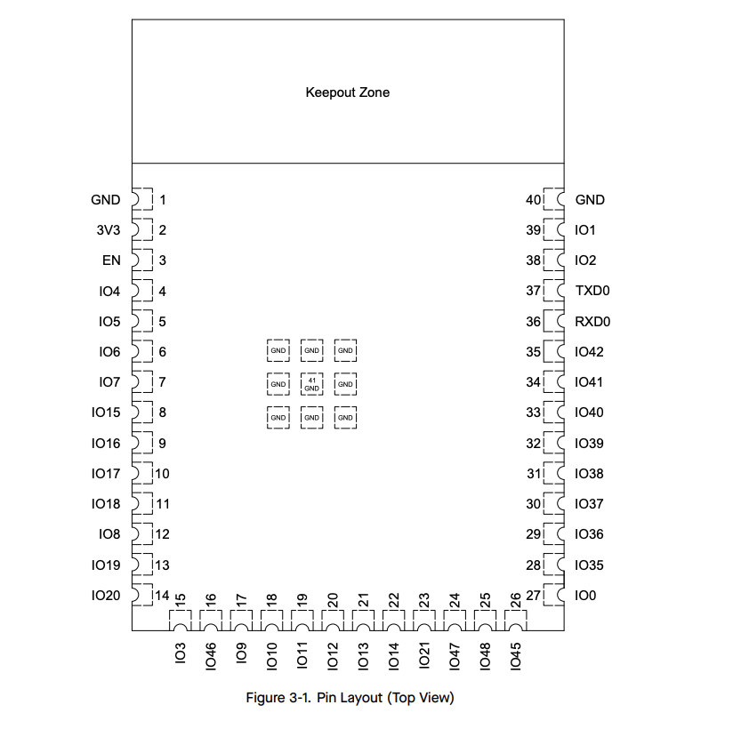
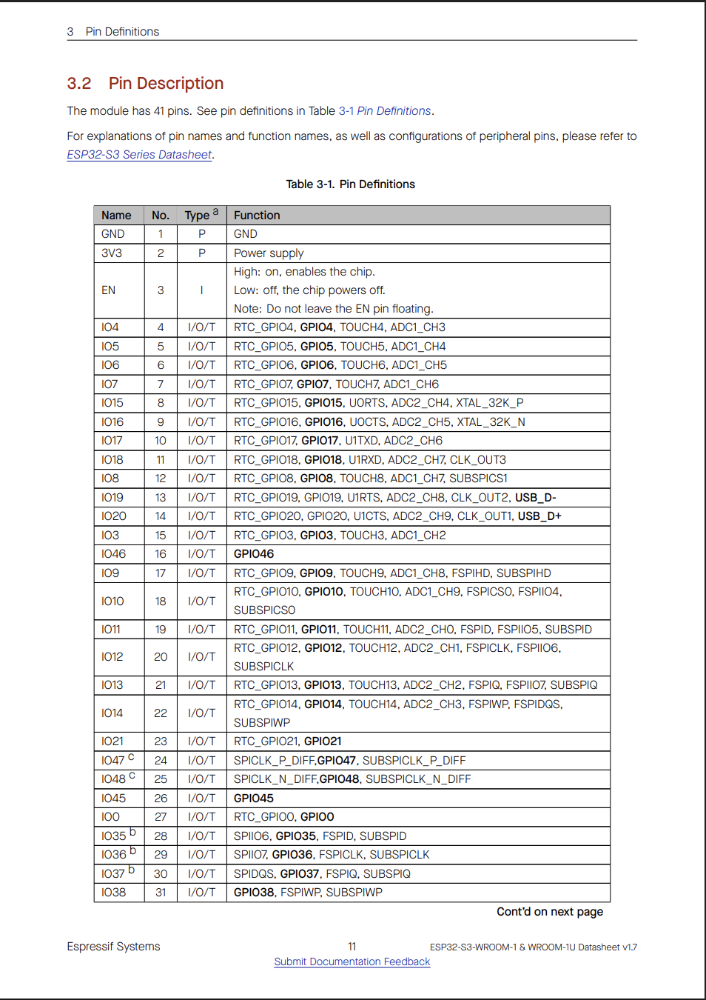

# ESP32 Wireless Communication — Microntroller Selection

## 1. Microcontroller Selection

Based on team subsystem planning:
- Laksh → PIC (Sensors & HMI)
- Raunak → PIC (Actuators)
- Mihir → ESP32 (Wireless Communication)

### Microcontrollers Considered

**Choice A — ESP32-S3-WROOM-1-N4 (selected)**  
- **Link / Datasheet:** [Datasheet](https://documentation.espressif.com/esp32-s3-wroom-1_wroom-1u_datasheet_en.pdf)
- **Type:** Surface-mount module (SMD) with integrated antenna, 4 MB flash  
- **Pros:** Integrated Wi-Fi/BLE, native USB support, camera interface support (ESP32-CAM), large GPIO count, pre-certified RF reduces layout risk.  
- **Cons:** Slightly larger footprint and higher per-unit cost than bare chip; module antenna performance depends on board placement.

**Choice B — ESP32-WROOM-32 (classic module)**  
- **Link / Datasheet:** [Datasheet](https://documentation.espressif.com/esp32-wroom-32_datasheet_en.pdf)  
- **Type:** Surface-mount module, classic ESP32 (older core)  
- **Pros:** Mature ecosystem, lots of community examples, widely available dev boards for testing.  
- **Cons:** Older architecture (no native USB, less optimized camera/USB support), fewer advanced peripheral features than S3; less headroom for camera streaming.

**Choice C — ESP32-S3 (bare QFN chip)**  
- **Link / Datasheet:** [Datasheet](https://documentation.espressif.com/esp32-s3_datasheet_en.pdf)  
- **Type:** Bare QFN package (lowest cost per unit)  
- **Pros:** Smallest PCB footprint, lowest BOM cost (chip only), maximum control over RF layout and BOM.  
- **Cons:** Requires custom RF layout and impedance matching (high risk for first spin), more difficult assembly (QFN), needs certified antenna or careful trace design.

**Selection Rationale (summary):** The ESP32-S3-WROOM-1-N4 (Choice A) gives the best tradeoff of RF reliability, native camera and USB support, and quick bring-up for the wireless gateway role. Choice B is a reasonable fallback if S3 modules are unavailable; Choice C is lowest cost but introduces RF design risk unacceptable for a first student PCB.

---

## 2. Selected Microcontroller

### ESP32-S3-WROOM-1-N4

- 41-pin surface-mount module
- Dual-core Xtensa LX7 processor
- Integrated Wi-Fi + BLE
- 4MB flash
- Native USB support
- Integrated PCB antenna
- 3.3V operating voltage

The module pin layout and definitions are shown in:

**Figure 01:** ESP32-S3-WROOM-1-N4 Module Pin Layout (Top View) (Figure 3.1)

**Figure 02:** ESP32-S3-WROOM-1-N4 - Pin Definitions (Table 3-1, Part 1)

**Figure 03:** ESP32-S3-WROOM-1-N4 - Pin Definitions (Table 3-1, Part 2)

These confirm:
- 3V3 = Pin 2  
- GND = Pins 1 and 40  
- EPAD = Ground  
- RXD0 = Pin 36 (GPIO44)  
- TXD0 = Pin 37 (GPIO43)  
- USB_D- = GPIO19 (Pin 13)  
- USB_D+ = GPIO20 (Pin 14)

---

## 3. Project-Specific Requirements

### For the wireless subsystem, the required peripherals are:

| Peripheral | Required | Quantity |
|------------|----------|----------|
| UART | Yes | 1 (RX + TX) |
| Wi-Fi | Yes | Integrated |
| Camera Interface | Yes | 1 (OV2640) |
| USB | Yes | 1 |
| GPIO | Yes | 4 Debug LEDs |
| SPI | No | 0 |
| I2C | No | 0 |
| ADC | No | 0 |
| DAC | No | 0 |
| PWM | Optional | 1 |

**Estimated required GPIO count: ~10–12**

---

## 4. Microcontroller Capability Comparison

| Feature | PIC18F47Q10 | ESP32-S3-WROOM-1-N4 | Required? | Result |
|----------|--------------|----------------------|------------|---------|
| 32-bit CPU | No (8-bit) | Yes | Preferred | ESP32 |
| Wi-Fi | No | Yes | Required | ESP32 |
| UART | Yes | Yes (3) | ≥1 | Both |
| Camera Support | No | Yes | Required | ESP32 |
| USB Native | Limited | Yes | Preferred | ESP32 |
| GPIO Count | ~36 | ~36 | ≥6 | Both |
| Flash | Limited | 4MB | ≥2MB | ESP32 |

### Evaluation

The PIC18F47Q10 does not support Wi-Fi or camera streaming without additional hardware modules.  
The ESP32-S3-WROOM-1-N4 directly satisfies all wireless and streaming requirements.

No critical requirements are unmet by the ESP32.

---

## 5. Pin Allocation Table (Verified Against Datasheet)

| Function | Module Pin | GPIO | Verified From Datasheet |
|----------|------------|------|--------------------------|
| 3.3V | Pin 2 | 3V3 | Figure 02: Table 3-1 |
| GND | Pins 1, 40 | GND | Figure 03: Table 3-1 |
| EPAD | Center Pad | GND | Figure 03: Table 3-1 |
| EN | Pin 3 | EN | Figure 02: Table 3-1 |
| UART TX | Pin 37 | GPIO43 | RXD0/TXD0 entry |
| UART RX | Pin 36 | GPIO44 | RXD0/TXD0 entry |
| USB D- | Pin 13 | GPIO19 | USB_D- entry |
| USB D+ | Pin 14 | GPIO20 | USB_D+ entry |
| MQTT LED | Pin 32 | GPIO39 | Figure 03: Table 3-1 |
| RX LED | Pin 33 | GPIO40 | Figure 03: Table 3-1 |
| TX LED | Pin 34 | GPIO41 | Figure 03: Table 3-1 |
| Status LED | Pin 31 | GPIO38 | Figure 02: Table 3-1 |
| Camera | Internal Camera Interface | Dedicated Pins | ESP32-S3 Camera Support |

### Pin Sufficiency Check

Total pins required ≈ 12  
Total available GPIO ≈ 30+  

There are no pin conflicts, and I double-checked all of them using the official pin definition table.

---

## 6. Role Description

I am responsible for the Wireless Communication subsystem. My board serves as the gateway between the internal UART daisy-chain system and the external MQTT server over Wi-Fi. I manage publish/subscribe messaging, forward structured UART packets, stream video from the onboard OV2640 camera, and provide local debug LED indicators. My subsystem isolates wireless complexity from the sensor and actuator subsystems to maintain modularity and simplify debugging.

---

## 7. Compatibility & Software Research

### Wi-Fi & MQTT
- Fully supported in ESP-IDF and Arduino.
- Stable networking stack.
- Extensive documentation and examples.

### ESP32-CAM / OV2640
- Official Espressif camera driver available.
- Supported by ESP32 examples.
- Requires sufficient memory allocation.

### UART
- Hardware UART with buffering.
- Reliable for daisy-chain structured packets.

### Known Considerations
- Wi-Fi transmission can cause current spikes.
- Camera streaming increases RAM usage.
- Proper decoupling and regulator sizing required.

No major compatibility conflicts were identified.

---

## 8. Final Microcontroller Selection

**Final Choice: ESP32-S3-WROOM-1-N4**

### Data-Driven Rationale

- Only microcontroller that directly meets Wi-Fi and camera requirements.
- Integrated antenna reduces RF layout risk.
- Native USB simplifies programming.
- Satisfies surface-mount requirement.
- Exceeds GPIO and UART needs.
- Strong ecosystem support lowers development risk.

The ESP32-S3-WROOM-1-N4 is therefore the optimal and necessary microcontroller for this subsystem.