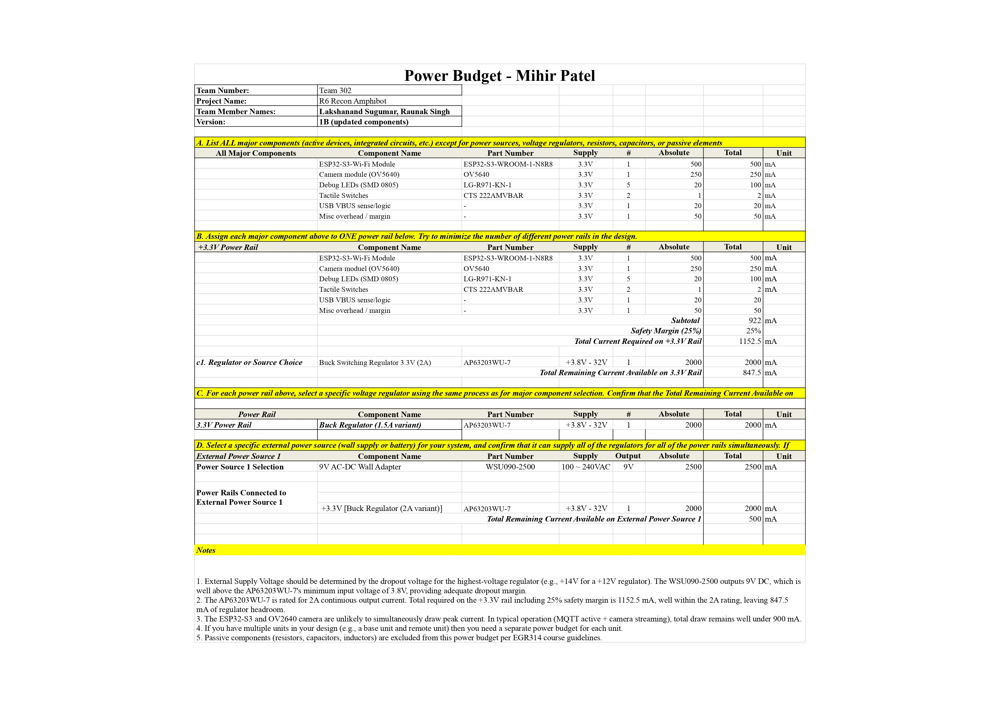

# Module's Power Budget

# Overview

This page presents the power budget for Mihir Patel's ESP32 Wireless Communication subsystem, verifying that all voltage rails, regulators, and the selected external power supply can reliably meet the total current demand of every major active component in the design.

The power budget covers:

- Peak current requirements of all major active components on the +3.3V rail
- Assigned voltage rail and total current consumption with a 25% safety margin
- Regulator selection verification confirming adequate current headroom
- External power source selection confirming the supply can drive all regulators simultaneously

This subsystem operates entirely from a single regulated +3.3V rail. The +3.3V rail can be sourced from either a 9V AC-DC wall adapter or the team's shared 12V battery, both feeding the onboard AP63203WU-7 switching buck regulator through protection diodes.

---

## Power Budget Table

**Figure 01:** ESP32 Wireless Communication Subsystem — Full Power Budget (Team 302, Version 1B)

---

### How the Power Budget Informed Design Choices

- The power budget was used to total the worst-case current draw of all major active components on the +3.3V rail. This includes the ESP32-S3-WROOM-1-N8R8 Wi-Fi module, OV5640 camera module, five debug LEDs, two tactile switches, USB VBUS sense logic, and a miscellaneous overhead margin. Summing each device's peak current gives a subtotal of 922 mA, and applying the required 25% safety margin brings the total current required on the +3.3V rail to 1152.5 mA.

- This requirement directly informed the regulator selection. The AP63203WU-7 synchronous buck regulator, rated for 2A continuous output, was selected to provide adequate overhead above the 1152.5 mA requirement. With 847.5 mA of headroom remaining, the regulator comfortably handles Wi-Fi transmission spikes and simultaneous camera streaming without approaching its current limit.

- The same budget was used to verify both external power sources. The primary standalone source is the WSU090-2500 9V AC-DC wall adapter, rated at 2500 mA. The secondary source is the team's shared 12V battery (B09ZTKTLGW), rated at 7000 mA. Both sources feed the AP63203WU-7 through onboard protection diodes (MBRS340T3G), and either source alone is sufficient to power the entire +3.3V rail. With the 9V adapter, 500 mA of headroom remains on the supply after accounting for the regulator's maximum draw. With the 12V battery, 5000 mA of headroom remains.

- The key conclusion from this analysis is that a single +3.3V regulated rail, supplied by either the 9V wall adapter or the 12V shared battery through the AP63203WU-7, is sufficient for all wireless, camera, and communication functions in this subsystem. No additional voltage rails are required.

---

### Downloadable Files

- **Power Budget EXCEL:**  
[Download Power Budget (Excel)](PowerBudget_MP.xlsx)

- **Power Budget ZIP:**  
[Download Power Budget (ZIP)](PowerBudget_MP.xlsx.zip)

- **Power Budget PDF:**  
[Download Power Budget (PDF)](PowerBudget_MP.pdf)

---

## Power Rails and Regulators

| **Power Rail** | **Regulator / Source** | **Part Number** | **Output Voltage** | **Max Current (mA)** | **Notes** |
|----------------|------------------------|------------------|--------------------|----------------------|------------|
| +3.3V | Synchronous Buck Regulator (2A) | AP63203WU-7 | +3.3V fixed | 2000 | Powers ESP32, camera, LEDs, switches, USB logic |

> All major components are powered from a single +3.3V regulated supply. This simplifies power distribution, reduces conversion losses, and improves overall system stability.

---

## Power Source Verification

| **Power Source** | **Part Number** | **Output** | **Max Current (mA)** | **Regulator Supplied** | **Remaining (mA)** |
|------------------|----------------|-----------|---------------------|---------------|-------------------|
| 9V AC-DC Wall Adapter | WSU090-2500 | 9V DC | 2500 | +3.3V [AP63203WU-7] | 500 |
| 12V Battery (Shared Team Source) | B09ZTKTLGW | 12V DC | 7000 | +3.3V [AP63203WU-7] | 5000 |

> The WSU090-2500 9V wall adapter is the primary standalone power source. It feeds the AP63203WU-7 buck regulator through an onboard protection diode (MBRS340T3G, ~0.45V drop), delivering approximately 8.55V to the regulator input, well above the 3.8V minimum. The 9V adapter alone is fully sufficient to regulate down to 3.3V for all components on the board.

> The 12V battery is the team's shared power source (Raunak's subsystem). It also connects to the same AP63203WU-7 through a protection diode, and can serve as an alternative or simultaneous supply. Either source alone is sufficient, both are within the regulator's 3.8V–32V input range.

---

### Power Budget Summary

This power budget accounts for the electrical demands of all active components in the ESP32 wireless communication subsystem, assigning each to a single +3.3V logic rail. Current estimates are based on worst-case peak consumption with a 25% safety margin applied.

The selected AP63203WU-7 regulator (2A variant, 2000 mA rated) exceeds the required 1152.5 mA with 847.5 mA of regulator headroom. Two external power sources are verified: the WSU090-2500 9V wall adapter (500 mA headroom) and the shared 12V team battery (5000 mA headroom). Both margins are positive, and either source alone is sufficient to drive the regulator.

No additional voltage rails are necessary. The chosen single-rail design simplifies the system while maintaining appropriate electrical headroom for continuous Wi-Fi operation, MQTT communication, and the OV5640 camera interface should streaming be enabled in a future hardware revision.