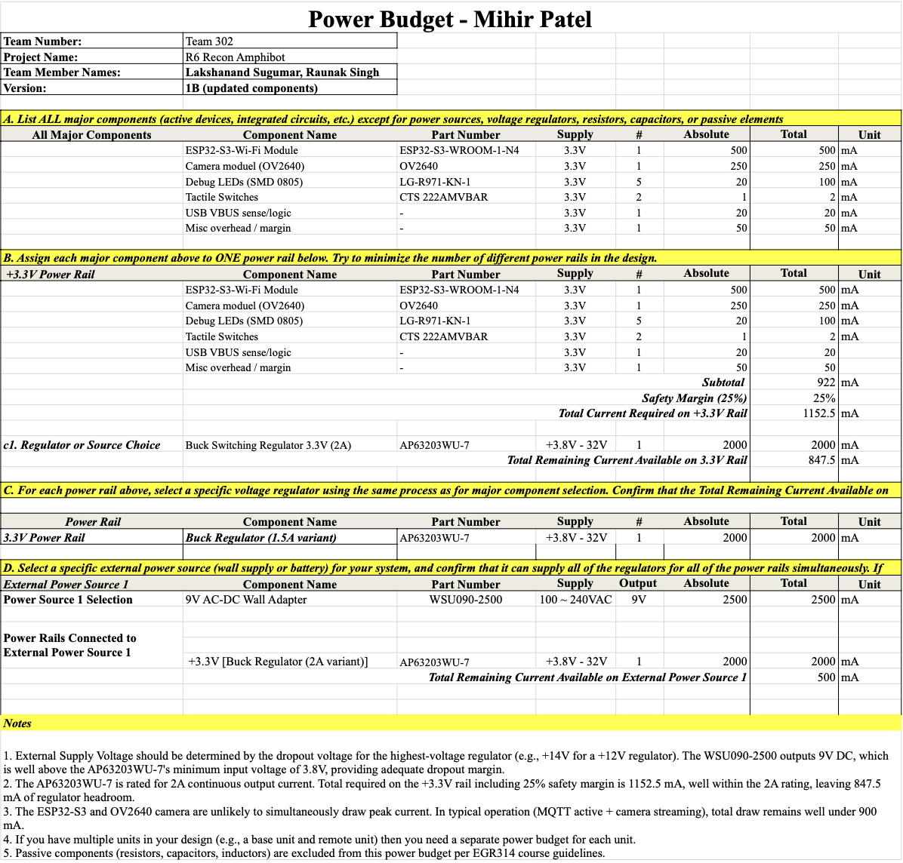

# Overview

This page presents the power budget for Mihir Patel's ESP32 Wireless Communication subsystem, verifying that all voltage rails, regulators, and the selected external power supply can reliably meet the total current demand of every major active component in the design.

The power budget covers:

- Peak current requirements of all major active components on the +3.3V rail
- Assigned voltage rail and total current consumption with a 25% safety margin
- Regulator selection verification confirming adequate current headroom
- External power source selection confirming the supply can drive all regulators simultaneously

This subsystem operates entirely from a single regulated +3.3V rail derived from a 9V AC-DC wall adapter through an onboard switching buck regulator.

---

## Power Budget Table

**Figure 01:** ESP32 Wireless Communication Subsystem — Full Power Budget (Team 302, Version 1B)

---

### How the Power Budget Informed Design Choices

- The power budget was used to total the worst-case current draw of all major active components on the +3.3V rail. This includes the ESP32-S3-WROOM-1-N8R8 Wi-Fi module, OV2640 camera module, five debug LEDs, two tactile switches, USB VBUS sense logic, and a miscellaneous overhead margin. Summing each device's peak current gives a subtotal of 922 mA, and applying the required 25% safety margin brings the total current required on the +3.3V rail to 1152.5 mA.

- This requirement directly informed the regulator selection. The AP63203WU-7 synchronous buck regulator, rated for 2A continuous output, was selected to provide adequate overhead above the 1152.5 mA requirement. With 847.5 mA of headroom remaining, the regulator comfortably handles Wi-Fi transmission spikes and simultaneous camera streaming without approaching its current limit.

- The same budget was used to verify the external power source. The WSU090-2500 9V AC-DC wall adapter, rated at 2500 mA, was selected to supply the regulator. Since the regulator draws at most 2000 mA from the 9V input, this leaves 500 mA of headroom on the supply, confirming no risk of overloading the wall adapter during normal or peak operation.

- The key conclusion from this analysis is that a single +3.3V regulated rail powered from a 9V wall adapter through the AP63203WU-7 is sufficient for all wireless, camera, and communication functions in this subsystem. No additional voltage rails or battery supply are required.

---

### Downloadable Files

- **Power Budget EXCEL:**  
[Download Power Budget (Excel)](PowerBudget_MP.xlsx)

- **Power Budget ZIP:**  
[Download Power Budget (ZIP)](PowerBudget_MP.xlsx.zip)

- **Power Budget PDF:**  
[Download Power Budget (PDF)](PowerBudget_MP.pdf)

---

## Power Rails and Regulators

| **Power Rail** | **Regulator / Source** | **Part Number** | **Output Voltage** | **Max Current (mA)** | **Notes** |
|----------------|------------------------|------------------|--------------------|----------------------|------------|
| +3.3V | Synchronous Buck Regulator (2A) | AP63203WU-7 | +3.3V fixed | 2000 | Powers ESP32, camera, LEDs, switches, USB logic |

> All major components are powered from a single +3.3V regulated supply. This simplifies power distribution, reduces conversion losses, and improves overall system stability.

---

## Power Source Verification

| **Power Source** | **Part Number** | **Output** | **Max Current (mA)** | **Regulator Supplied** | **Remaining (mA)** |
|------------------|----------------|-----------|---------------------|---------------|-------------------|
| 9V AC-DC Wall Adapter | WSU090-2500 | 9V DC | 2500 | +3.3V [AP63203WU-7] | 500 |

> The WSU090-2500 9V wall adapter feeds the AP63203WU-7 buck regulator, which supplies the entire +3.3V rail. The 9V output is well above the regulator's minimum input voltage of 3.8V, providing adequate dropout margin.

> No battery supply is required for this subsystem.

---

### Power Budget Summary

This power budget accounts for the electrical demands of all active components in the ESP32 wireless communication subsystem, assigning each to a single +3.3V logic rail. Current estimates are based on worst-case peak consumption with a 25% safety margin applied.

The selected AP63203WU-7 regulator (2A rated) exceeds the required 1152.5 mA with 847.5 mA of regulator headroom, and the WSU090-2500 9V wall adapter provides 500 mA of supply headroom above the regulator's maximum draw. Both margins are positive, confirming the power architecture is sound.

No additional voltage rails are necessary. The chosen single-rail design simplifies the system while maintaining appropriate electrical headroom for continuous Wi-Fi operation, MQTT communication, and camera streaming.