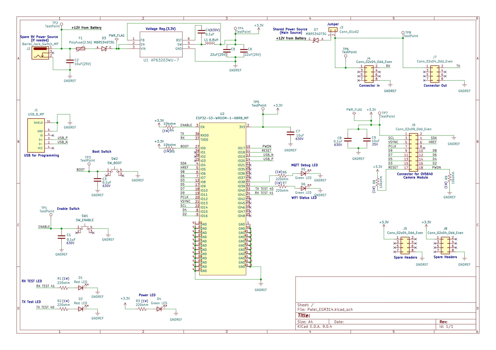

## Individual Subsystem Schematic

This schematic shows the complete design for my Wireless Communication subsystem. It includes the ESP32-S3-WROOM-1-N8R8 microcontroller module, switching 3.3V power supply (AP63203WU-7 buck regulator), barrel jack input with fuse and reverse polarity protection, USB micro connector for programming, UART daisy-chain ribbon connectors, boot and enable circuitry, debug LEDs, and expansion headers.

The schematic demonstrates all required power regulation, signal routing, protection circuitry, and communication interfaces necessary for reliable subsystem operation and integration within the team's UART-based daisy-chain architecture.

Two schematic-specific net label conventions are worth noting: the USB differential pair is labeled USB_N (D−, GPIO19) and USB_P (D+, GPIO20) rather than the more common D+/D− naming, and the OV5640 camera module connects via J6, a 2×9 pin header whose signals are fully isolated from the UART daisy-chain connectors J4 and J7.

**Figure 01:** Wireless Communication Subsystem Schematic

---

### Downloadable Files

- **Project ZIP:**  
  [Download KiCad Project ZIP](Patel_EGR314_projectzip_4_11.zip)

- **Symbol Library ZIP:**  
  [Download Symbol Library ZIP](Patel_314_symbols.zip)

- **Schematic Image:**  
  [Wireless Communication Schematic](Patel_EGR314_Schematic_MP_4_11.jpg "Wireless Communication Schematic")

- **Schematic PDF:**  
  [Download High-Resolution Schematic PDF](Patel_EGR314_Schematic_MP_4_11.pdf)