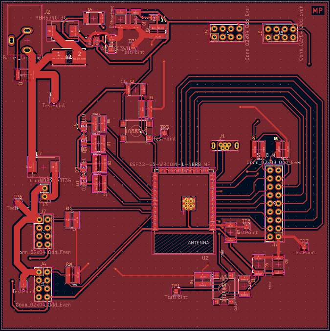
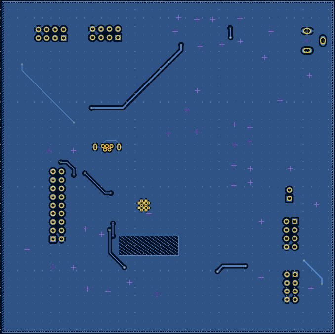
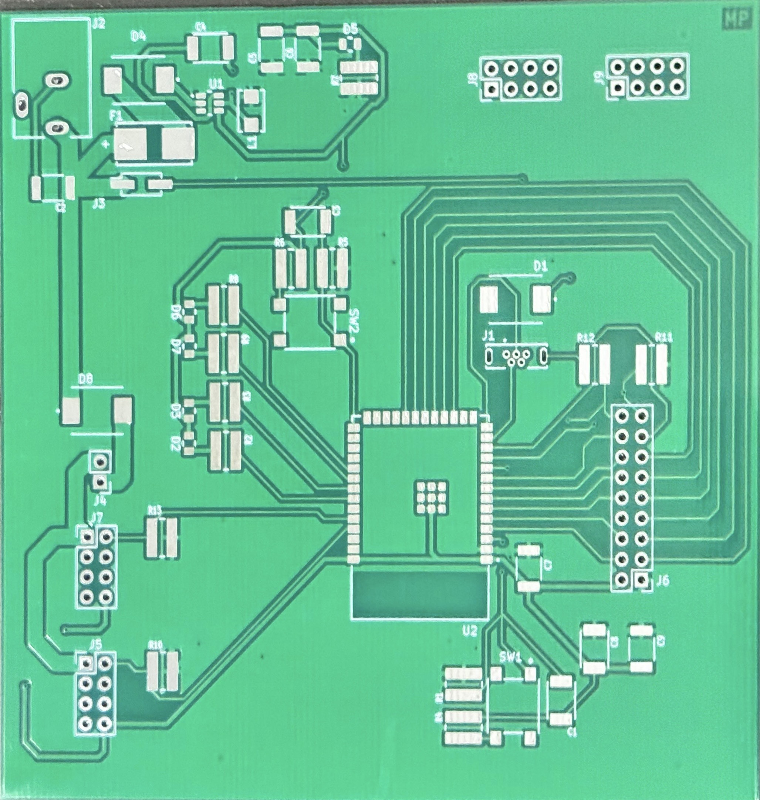
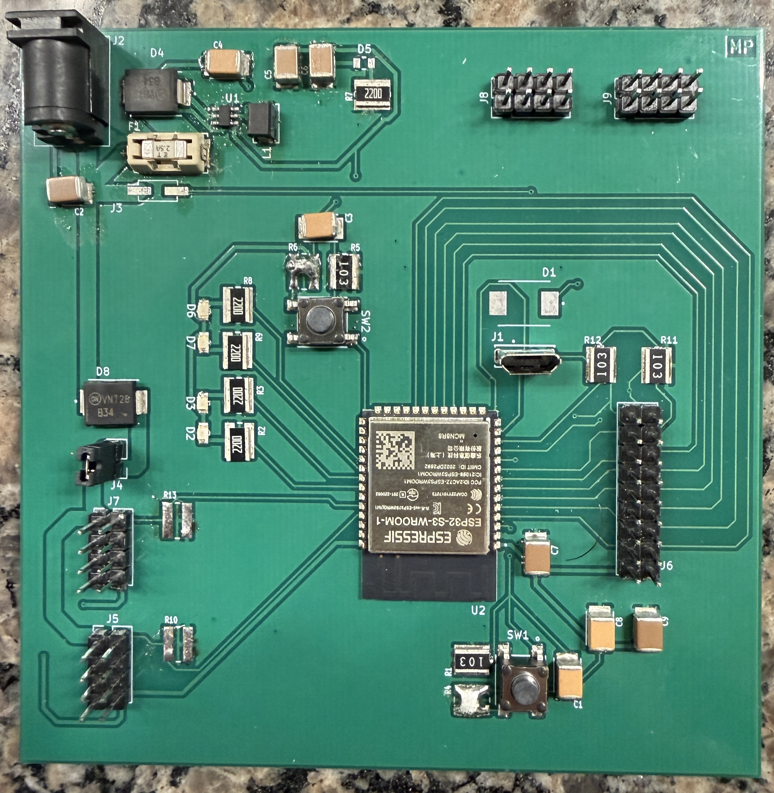
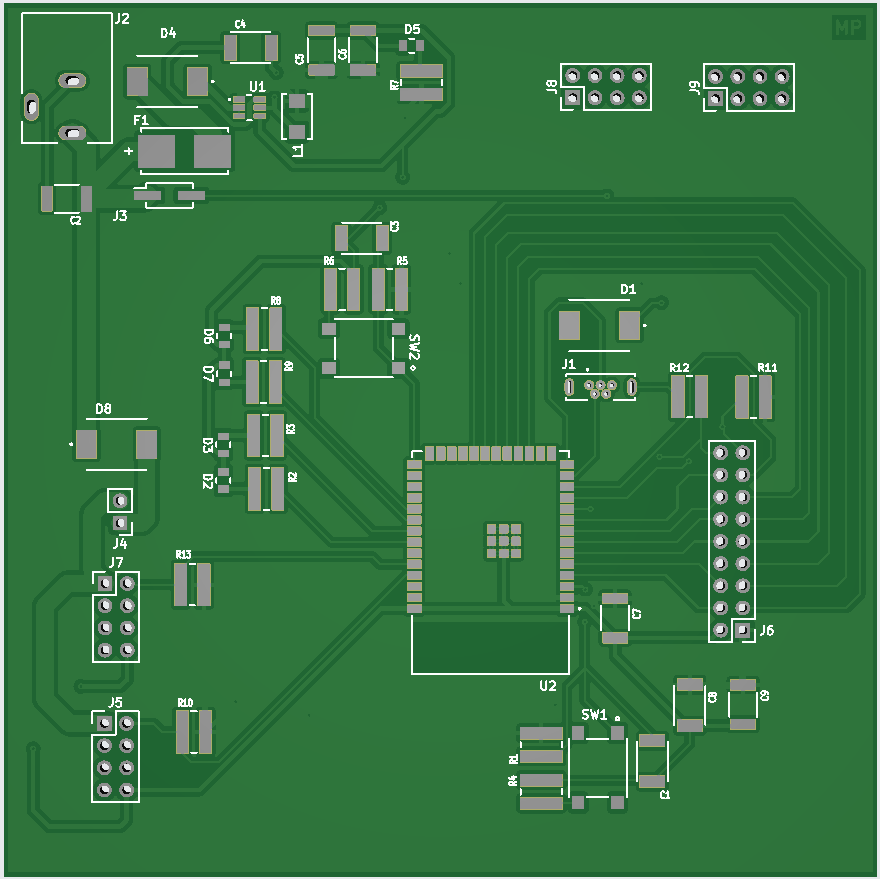
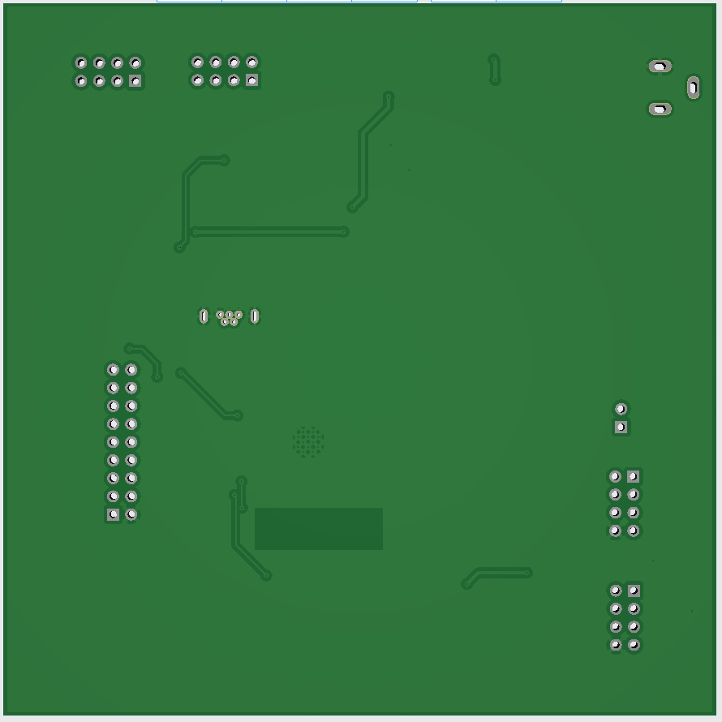

## PCB Design

This page contains all design files and documentation for the ESP32 Wireless 
Communication Subsystem, including the PCB layout. The system integrates an 
ESP32-S3-WROOM-1-N8R8 Wi-Fi module, OV5640 camera module, AP63203WU-7 buck 
regulator, debug LEDs, tactile switches, and supporting circuitry for wireless 
communication and image capture.

---

## ECAD Layer Views

**Figure 01:** PCB Top Layer View (ECAD)

**Figure 02:** PCB Bottom Layer View (ECAD)

---

## Physical PCB Photos

**Figure 03:** Raw PCB Before Population (before soldering)

**Figure 04:** Finalized PCB After Soldering and Testing

**Figure 05:** PCB Front View (populated)

**Figure 06:** PCB Back View (populated)

---

### Supporting Files

- **Project ZIP:**  
  [Download KiCad Project ZIP](Patel_EGR314_projectzip_4_11.zip)

- **PCB Gerber Files ZIP:**  
  [Download PCB Gerber Files ZIP](Gerber_drill_4_10_26.zip)

- **PCB Footprints Library ZIP:**  
  [Download PCB Footprints Library ZIP](pcb_footprints.pretty.zip)

- **PCB PDF:**  
  [Wireless Communication PCB PDF](pcb_MP.pdf)

- **PCB Top Layer Image:**  
  [Wireless Communication PCB Top Layer Image](pcb_front_MP.png)

- **PCB Top Layer PDF:**  
  [Wireless Communication PCB Top Layer PDF](pcb_front_MP.pdf)

- **PCB Bottom Layer Image:**  
  [Wireless Communication PCB Bottom Layer Image](pcb_back_MP.png)

- **PCB Bottom Layer PDF:**  
  [Wireless Communication PCB Bottom Layer PDF](pcb_back_MP.pdf)